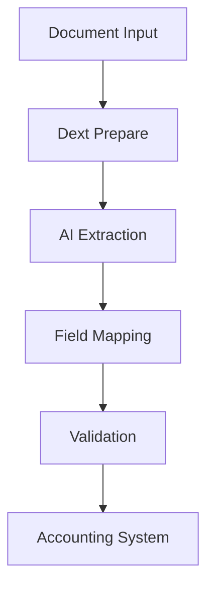

**Category:** Bookkeeping & Financial Management
**Difficulty:** Intermediate
**Reading time:** 6 min read

---

Dext Prepare is the document extraction component of the Dext platform (formerly Receipt Bank Prepare), providing automated OCR and AI-powered data extraction from receipts, invoices, and financial documents for accounting integration.

- **Document Digitization** — converting paper and digital documents
- **Intelligent Extraction** — AI-powered OCR and data recognition
- **Field Mapping** — matching extracted data to accounting fields
- **Quality Assurance** — validation and accuracy verification
- **Integration** — posting to accounting software

Dext Prepare uses advanced machine learning to extract financial data from unstructured documents. The system accepts images, PDFs, and electronic documents of receipts and invoices. It analyzes document content to identify and extract fields including vendor, amount, date, tax, and line items. The AI learns from corrections and improves accuracy over time. Extracted data maps to accounting fields for direct posting to accounting software. The system includes workflow automation allowing documents to route for approval before posting. Quality metrics track extraction accuracy and flag documents requiring human review. Integration with Xero, QuickBooks, NetSuite, and other accounting systems enables seamless data transfer.

- Automating invoice and receipt data entry
- Processing high volumes of vendor invoices
- Creating supplier records from invoices
- Extracting tax information for reconciliation
- Building digital audit trails

| Advantage | Disadvantage |
|-----------|--------------|
| Advanced AI extraction | Initial setup complexity |
| High accuracy rates | Learning curve for training |
| Seamless accounting integration | Dependent on document quality |
| Workflow automation | Per-document processing costs |
| Continuous learning | Manual review still needed sometimes |

- [Receipt Bank (now Dext)](receipt-bank-now-dext.md)
- [Dext Commerce e-commerce accounting](dext-commerce-e-commerce-accounting.md)
- [AutoEntry receipt capture](autoentry-receipt-capture.md)

---
*Part of the [Bookkeeping & Financial Management](bookkeeping-financial-management/index.md) category · [Back to Master Index](../../index.md)*
