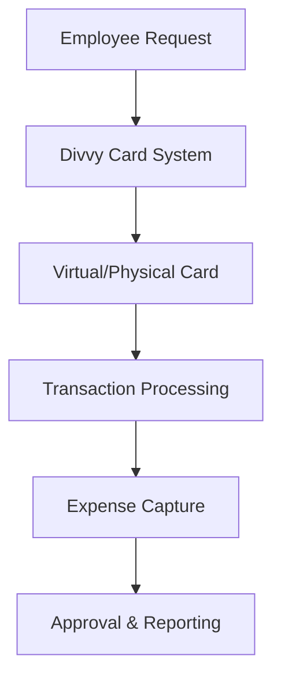

**Category:** Bookkeeping & Financial Management
**Difficulty:** Intermediate
**Reading time:** 6 min read

---

Divvy is a comprehensive expense management platform that enables organizations to control spending through virtual and physical corporate cards, automated expense tracking, and real-time financial insights. It consolidates expense management, corporate card issuance, and policy enforcement into a single platform designed for modern businesses.

- **Virtual Cards** — single-use or multi-use digital payment cards
- **Physical Cards** — branded corporate cards issued to employees
- **Real-time Tracking** — instant visibility into spending and receipts
- **Policy Enforcement** — automated compliance with company spending rules
- **Reporting & Analytics** — comprehensive spending dashboards and reports

Divvy operates as an all-in-one platform for expense management and corporate card issuance. Employees receive physical or virtual cards with spending limits set by the organization. When transactions occur, they're automatically captured and categorized in real-time. The platform uses receipt scanning and AI to extract expense details, reducing manual data entry. Managers can set spending policies and limits, with the system automatically enforcing compliance. All data flows into centralized dashboards that provide real-time visibility into company spending, categories, and budget utilization. Integration with accounting systems enables seamless reconciliation and journal entry creation.

- Eliminating per diem reimbursement processes
- Controlling employee spending through dynamic limits
- Automating receipt capture and expense categorization
- Real-time expense tracking and budget monitoring
- Streamlining month-end close and accounting reconciliation

| Advantage | Disadvantage |
|-----------|--------------|
| Eliminates reimbursement delays | Card issuance process takes time |
| Real-time spending visibility | Learning curve for users |
| Automated receipt capture | Requires policy setup and governance |
| Reduced accounting workload | Integration setup complexity |
| Spending controls and limits | Monthly subscription costs |

- [Ramp spend management](ramp-spend-management.md)
- [Brex corporate card platform](brex-corporate-card-platform.md)
- [Bank reconciliation automation](bank-reconciliation-automation.md)

---
*Part of the [Bookkeeping & Financial Management](bookkeeping-financial-management/index.md) category · [Back to Master Index](../../index.md)*
