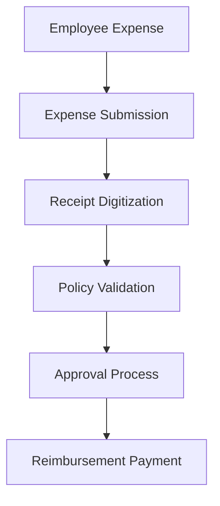

**Category:** Bookkeeping & Financial Management
**Difficulty:** Intermediate
**Reading time:** 6 min read

---

Emburse is an expense management software platform that provides receipt capture, expense categorization, and payment processing all integrated into a single solution. It enables organizations to automate employee reimbursement, reduce fraud, and streamline financial operations through advanced policy controls and analytics.

- **Receipt Scanning** — OCR-powered document digitization
- **Expense Processing** — automated categorization and validation
- **Payment Processing** — direct reimbursement to employees
- **Policy Controls** — real-time spending limit enforcement
- **Analytics** — spending insights and reporting

Emburse handles the complete expense lifecycle from capture to reimbursement. Employees submit expenses through the mobile app with attached receipts. The platform uses OCR and AI to extract details automatically, reducing manual data entry. The system applies company policy rules in real-time to validate expenses against spending limits, approved vendors, and categorization rules. Policy violations trigger exceptions that require managerial review. Approved expenses route through configurable workflows based on amount, department, and category. Once fully approved, the system can process reimbursements directly to employee bank accounts. Finance teams gain comprehensive reporting on spending patterns, policy violations, and cost centers. Integration with accounting systems enables automatic journal entry creation.

- Automating employee expense reimbursement processes
- Enforcing spending policies through automated validation
- Capturing and digitizing receipts at scale
- Reducing expense fraud through policy controls
- Streamlining accounts payable workflows

| Advantage | Disadvantage |
|-----------|--------------|
| Comprehensive policy controls | User adoption challenges |
| Fast reimbursement processing | Integration setup complexity |
| Advanced OCR accuracy | Pricing scales with volume |
| Strong reporting capabilities | Mobile app learning curve |
| Fraud detection features | Requires clear policy definition |

- [Brex expense management](brex-expense-management.md)
- [Chrome River expense reports](chrome-river-expense-reports.md)
- [Bank reconciliation automation](bank-reconciliation-automation.md)

---
*Part of the [Bookkeeping & Financial Management](bookkeeping-financial-management/index.md) category · [Back to Master Index](../../index.md)*
