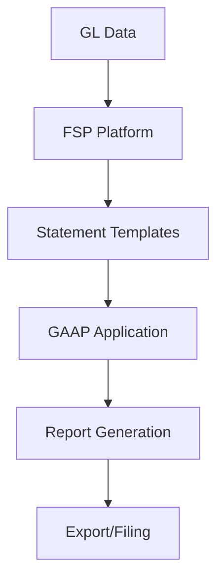

**Category:** Bookkeeping & Financial Management
**Difficulty:** Intermediate
**Reading time:** 6 min read

---

Financial statement preparation platforms automate the creation of standardized financial statements including income statements, balance sheets, and cash flow statements. These tools compile accounting data and apply accounting standards to generate audit-ready financial reports.

- **Statement Generation** — automated report creation
- **GAAP Compliance** — adherence to accounting standards
- **Variance Analysis** — comparing actual to budget
- **Consolidation** — multi-entity financial reporting
- **Audit Trail** — tracking statement preparation

Financial statement preparation platforms pull data directly from the general ledger and balance sheet records. The system applies accounting rules to classify and organize GL accounts. It calculates subtotals, consolidated figures, and performs variance analysis against prior periods or budgets. The platform applies GAAP or IFRS rules depending on reporting requirements. It can handle multi-entity consolidation combining data from subsidiary companies. Reports are generated in standardized formats suitable for creditors, lenders, or regulatory filing. Version control tracks changes to statements as adjustments are made. Export functions provide Excel, PDF, or filing-ready formats.

- Automating monthly financial statement generation
- Creating consolidated statements for multi-entity companies
- Generating statements for bank or creditor requirements
- Producing variance analysis reports
- Streamlining audit preparation

| Advantage | Disadvantage |
|-----------|--------------|
| Automated statement creation | Complex setup for multi-entity |
| Reduced manual entry | Industry-specific limitations |
| Consistent formatting | Learning curve for power users |
| Variance analysis | Limited customization |
| Audit compliance | Dependent on GL quality |

- [Month-end close automation](month-end-close-automation.md)
- [Bank reconciliation automation](bank-reconciliation-automation.md)
- [QuickBooks Expense tracking](quickbooks-expense-tracking.md)

---
*Part of the [Bookkeeping & Financial Management](bookkeeping-financial-management/index.md) category · [Back to Master Index](../../index.md)*
