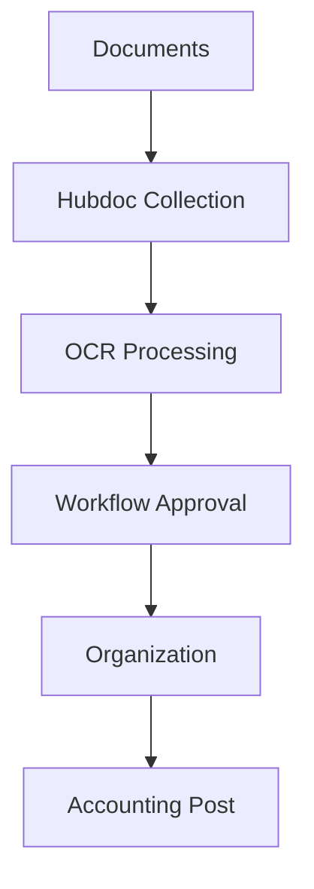

**Category:** Bookkeeping & Financial Management
**Difficulty:** Intermediate
**Reading time:** 6 min read

---

Hubdoc is a document management and workflow automation platform designed for accounting teams to capture, organize, and process financial documents. It provides OCR, approval workflows, and integration with accounting systems to streamline document-based accounting processes.

- **Document Collection** — gathering documents from multiple sources
- **OCR Scanning** — automated text extraction from documents
- **Workflow Automation** — approval routing and processing
- **Document Organization** — categorization and filing
- **Accounting Integration** — posting to accounting software

Hubdoc provides a centralized repository for financial documents with automated processing workflows. Documents come in through multiple channels: email forwarding, file uploads, API integrations, and direct connections to banks and vendors. The system uses OCR to extract text and data from documents for searchability and validation. Documents flow through customizable approval workflows where team members can review, approve, or request changes. Once approved, documents are automatically organized into folders and filed based on type and content. The system can extract specific data fields and post transactions to accounting software like QuickBooks, Xero, or NetSuite. An audit trail tracks all actions taken on each document for compliance purposes.

- Creating centralized financial document repositories
- Automating document approval workflows
- Extracting data from vendor invoices and statements
- Organizing receipts and supporting documentation
- Maintaining audit-ready document archives

| Advantage | Disadvantage |
|-----------|--------------|
| Flexible document workflows | Complex configuration |
| Multiple input channels | Integration setup time |
| Strong OCR performance | Subscription costs |
| Customizable workflows | User adoption curve |
| Audit trail capabilities | Limited analytics |

- [Receipt Bank (now Dext)](receipt-bank-now-dext.md)
- [AutoEntry receipt capture](autoentry-receipt-capture.md)
- [Shoeboxed receipt scanning](shoeboxed-receipt-scanning.md)

---
*Part of the [Bookkeeping & Financial Management](bookkeeping-financial-management/index.md) category · [Back to Master Index](../../index.md)*
