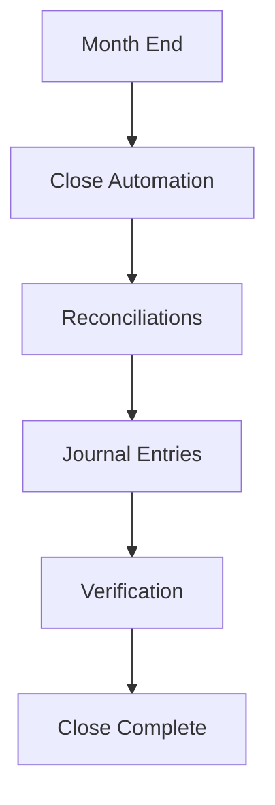

**Category:** Bookkeeping & Financial Management
**Difficulty:** Intermediate
**Reading time:** 6 min read

---

Month-end close automation tools streamline the financial closing process through automated reconciliation, journal entry processing, and balance verification. These platforms reduce the time required for monthly accounting close from weeks to days.

- **Reconciliation Automation** — automatic account matching
- **Journal Entry Automation** — recurring and template-based entries
- **Close Checklists** — workflow task management
- **Balance Verification** — automated variance detection
- **Reporting** — close status and variance dashboards

Month-end close automation platforms orchestrate the accounting close process. The system maintains lists of all accounts requiring reconciliation with templates for matching transactions. Automated routines match bank transactions to GL entries, identify clearing accounts, and flag variances requiring investigation. The platform manages recurring journal entries and provides templates for standard adjustments. It tracks close tasks and assigns them to team members with deadline tracking. The system validates the trial balance, checking that debits equal credits and flagging unexpected GL account balances. Close status dashboards show progress and identify bottlenecks. Integration with accounting systems ensures data accuracy and prevents manual entry errors.

- Accelerating month-end close cycles
- Reducing manual reconciliation workload
- Automating recurring journal entries
- Managing close task workflows
- Identifying and resolving close variances

| Advantage | Disadvantage |
|-----------|--------------|
| Significantly faster close | Complex initial setup |
| Reduces manual errors | Ongoing maintenance required |
| Improves team efficiency | Learning curve for users |
| Better close visibility | Integration complexity |
| Consistent processes | Customization limitations |

- [Bank reconciliation automation](bank-reconciliation-automation.md)
- [Financial statement preparation platforms](financial-statement-preparation-platforms.md)
- [Ramp spend management](ramp-spend-management.md)

---
*Part of the [Bookkeeping & Financial Management](bookkeeping-financial-management/index.md) category · [Back to Master Index](../../index.md)*
