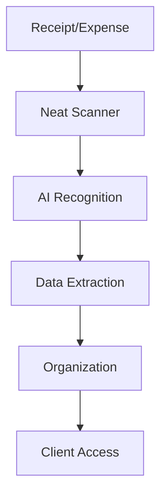

**Category:** Bookkeeping & Financial Management
**Difficulty:** Intermediate
**Reading time:** 6 min read

---

Neat is a receipt and expense management platform that uses advanced OCR and AI to automatically extract and organize financial transaction data. It serves accountants and bookkeepers with tools for receipt management, expense tracking, and mileage logging.

- **Smart Scanning** — AI-powered receipt recognition
- **Automatic Extraction** — intelligent data capture
- **Receipt Organization** — automatic filing and categorization
- **Mileage Tracking** — automatic business distance logging
- **CPA/Bookkeeper Tools** — client management features

Neat provides intelligent receipt management using advanced AI and OCR technology. Users scan receipts through the mobile app or email receipts to a dedicated address. The system analyzes receipt images to recognize and extract key data: vendor, date, amount, category, and payment method. Neat's AI learns from patterns and user feedback to improve accuracy. Receipts are automatically organized by category, date, and vendor. The mileage tracking feature works through smartphone GPS to automatically log business miles. Accountants and bookkeepers can create client accounts and provide secure access for clients to upload receipts. The platform generates reports organized for tax filing. Integration with major accounting software allows direct posting when needed.

- Managing receipts for self-employed individuals
- Automating receipt collection from clients
- Organizing mileage records for business deductions
- Preparing documentation for tax season
- Streamlining bookkeeping record collection

| Advantage | Disadvantage |
|-----------|--------------|
| Excellent OCR accuracy | Limited accounting integration |
| Automatic mileage tracking | Subscription pricing |
| Great for CPAs/bookkeepers | Mobile app requires user adoption |
| Good categorization | Limited approval workflows |
| Client portal | Not full expense management |

- [Shoeboxed receipt scanning](shoeboxed-receipt-scanning.md)
- [Hubdoc document management](hubdoc-document-management.md)
- [AutoEntry receipt capture](autoentry-receipt-capture.md)

---
*Part of the [Bookkeeping & Financial Management](bookkeeping-financial-management/index.md) category · [Back to Master Index](../../index.md)*
