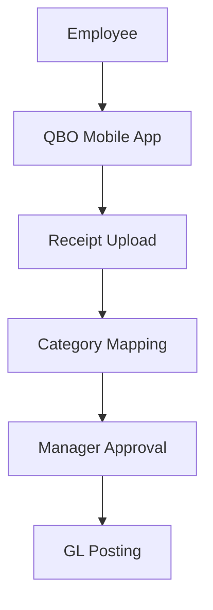

**Category:** Bookkeeping & Financial Management
**Difficulty:** Intermediate
**Reading time:** 6 min read

---

QuickBooks Expense tracking is Intuit's native expense management feature integrated directly into QuickBooks Online. It provides receipt capture, expense categorization, and approval workflows that connect seamlessly with the accounting system for streamlined financial management.

- **Receipt Capture** — photo and document upload
- **Expense Categorization** — mapping to GL accounts
- **Approval Workflows** — manager review and authorization
- **Accounting Integration** — direct GL posting
- **Mobile App** — on-the-go expense submission

QuickBooks Expense tracking is built into QuickBooks Online as a native feature. Employees use the QB mobile app to photograph receipts and add expense details. The system automatically categorizes expenses based on GL accounts defined in the chart of accounts. Expenses route to assigned managers for approval based on amount thresholds and approval policies. Approved expenses are automatically posted to the general ledger without requiring manual journal entry creation. The system maintains an audit trail of all approvals and changes. Finance teams can view expense status through the QB dashboard and run reports on spending by category and employee. Because it's native to QB, there's no separate integration or data synchronization needed.

- Managing small business employee expenses
- Capturing expenses directly in the accounting system
- Reducing manual data entry for accounts payable
- Creating audit trails for expense approval
- Integrating expense management with cash management

| Advantage | Disadvantage |
|-----------|--------------|
| Native QB integration | Limited to QB ecosystem |
| No separate license | Simpler workflow options |
| Simple setup and use | Fewer policy controls |
| Direct GL posting | Limited analytics |
| Included with QB | Mobile app can be slow |

- [Zoho Expense tracking](zoho-expense-tracking.md)
- [Emburse expense software](emburse-expense-software.md)
- [Receipt Bank (now Dext)](receipt-bank-now-dext.md)

---
*Part of the [Bookkeeping & Financial Management](bookkeeping-financial-management/index.md) category · [Back to Master Index](../../index.md)*
