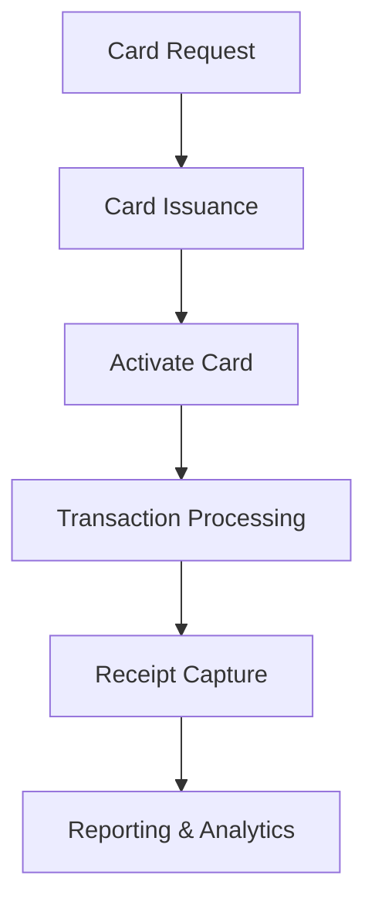

**Category:** Bookkeeping & Financial Management
**Difficulty:** Intermediate
**Reading time:** 6 min read

---

Ramp corporate cards are physical and virtual payment cards issued through the Ramp platform with embedded spending controls, real-time approval workflows, and automatic receipt capture. They provide companies with a secure, controllable way to manage employee spending while reducing the need for reimbursement processes.

- **Physical Cards** — branded corporate cards with embedded controls
- **Virtual Cards** — single-use or multi-use digital payment cards
- **Spending Limits** — real-time budget enforcement per employee
- **Approval Workflows** — automatic approval or hold based on policies
- **Receipt Integration** — automatic scanning and categorization

Ramp corporate cards are issued with preconfigured spending limits and policies that are enforced in real-time at the point of transaction. Physical cards are shipped within days and can be immediately activated. Virtual cards can be generated instantly for online purchases. Each card is tied to an employee's profile with specific spending limits by category and amount. When a transaction occurs, the card validates against current policies and either approves or holds the transaction pending manual approval. Receipts are automatically captured through the Ramp mobile app or email forwarding, and the system uses OCR and AI to extract invoice details. All transactions sync to the accounting system, creating reconcilable records.

- Issuing employee cards with embedded spending controls
- Creating virtual cards for online purchases and subscriptions
- Enforcing compliance with corporate spending policies
- Automating receipt management across the organization
- Reducing fraud and unauthorized spending

| Advantage | Disadvantage |
|-----------|--------------|
| Real-time spending controls | Per-card monthly fees |
| Instant virtual card creation | Integration setup required |
| Automatic receipt capture | Policy configuration complexity |
| Fraud prevention | Lost card replacement delays |
| Employee convenience | Requires employee adoption |

- [Ramp spend management](ramp-spend-management.md)
- [Brex corporate card platform](brex-corporate-card-platform.md)
- [Divvy expense management](divvy-expense-management.md)

---
*Part of the [Bookkeeping & Financial Management](bookkeeping-financial-management/index.md) category · [Back to Master Index](../../index.md)*
