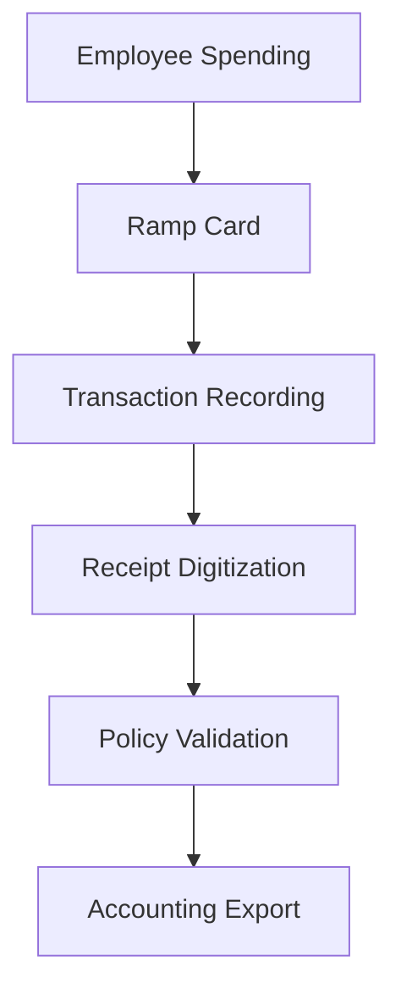

**Category:** Bookkeeping & Financial Management
**Difficulty:** Intermediate
**Reading time:** 6 min read

---

Ramp is a finance operations platform that provides spend management through corporate cards, automated receipt capture, and integrated accounting workflows. It combines card issuance, expense tracking, and accounting automation into a unified platform designed to reduce financial operations overhead.

- **Spend Controls** — granular policies for expense limits and categories
- **Receipt Capture** — AI-powered receipt scanning and digitization
- **Card Management** — issuance and control of physical and virtual cards
- **Policy Enforcement** — automated rule-based approval workflows
- **Accounting Integration** — direct connection to general ledger and accounting software

Ramp provides comprehensive spend management by issuing corporate cards with built-in policy controls and issuing virtual cards for online purchases. Every transaction is automatically categorized and matched with receipt data collected through mobile app scanning or email forwarding. The platform enforces spending policies in real-time, requiring approval for exceptions before payment is processed. All transactions sync directly to accounting software like QuickBooks or NetSuite, creating journal entries automatically. Managers gain real-time dashboards showing spending by team, category, and vendor, with the ability to adjust budgets and policies on the fly.

- Controlling spending through automated policy enforcement
- Eliminating manual receipt collection and expense reports
- Automating accounting workflows and journal entries
- Real-time visibility into departmental spending
- Streamlining vendor management and spend analysis

| Advantage | Disadvantage |
|-----------|--------------|
| Strong automation of accounting workflows | Requires accounting software integration |
| Real-time policy enforcement | Setup complexity for policies |
| Comprehensive spend visibility | Learning curve for policy configuration |
| Reduces accounting workload | Card program fees |
| Direct accounting integration | Per-employee card costs |

- [Divvy expense management](divvy-expense-management.md)
- [Brex expense management](brex-expense-management.md)
- [Month-end close automation](month-end-close-automation.md)

---
*Part of the [Bookkeeping & Financial Management](bookkeeping-financial-management/index.md) category · [Back to Master Index](../../index.md)*
