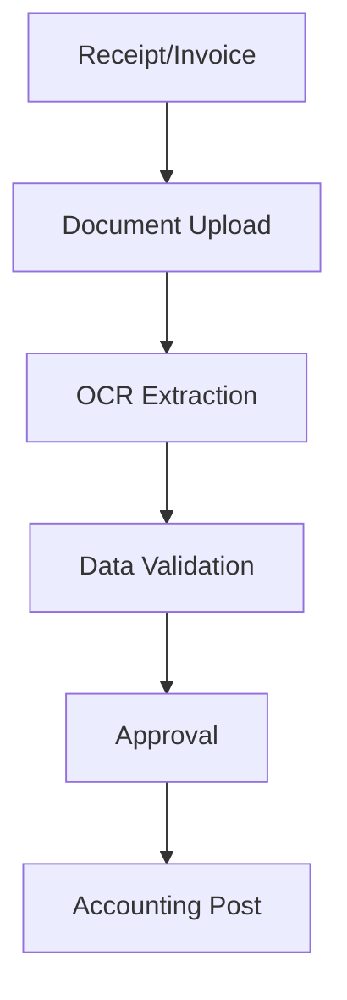

**Category:** Bookkeeping & Financial Management
**Difficulty:** Intermediate
**Reading time:** 6 min read

---

Receipt Bank, now part of Dext, is a cloud-based document capture and processing platform that digitizes receipts and invoices for accounting purposes. It uses AI and OCR to extract transaction data and automatically post to accounting software, streamlining accounts payable and expense management workflows.

- **Document Capture** — receipt and invoice scanning
- **OCR Technology** — automated data extraction
- **Data Validation** — AI-powered accuracy verification
- **Accounting Integration** — direct posting to accounting systems
- **Workflow Automation** — approval routing and posting

Receipt Bank provides comprehensive document capture for accounting teams. Users can submit receipts and invoices through the mobile app, email, or web portal. The platform uses advanced OCR and AI to automatically extract key information including vendor name, amount, date, and invoice number. The system validates extracted data against known vendors and transaction rules to ensure accuracy. Documents can route through approval workflows for manager review and authorization. Once approved, the system posts transactions directly to accounting software like Xero, QuickBooks, or NetSuite. It can create supplier records, invoice entries, and expense allocations automatically. The platform maintains a complete digital archive of all documents for audit purposes.

- Digitizing receipt and invoice processes
- Automating accounts payable data entry
- Creating supplier and transaction records
- Building complete audit-ready receipt archives
- Streamlining expense reimbursement processes

| Advantage | Disadvantage |
|-----------|--------------|
| Powerful OCR technology | Subscription cost per user |
| Wide accounting integration | Setup complexity |
| Mobile and email submission | Accuracy issues with poor scans |
| Audit trail and archival | Requires employee adoption |
| Workflow automation | Integration overhead |

- [Dext Prepare document extraction](dext-prepare-document-extraction.md)
- [Dext Commerce e-commerce accounting](dext-commerce-e-commerce-accounting.md)
- [Hubdoc document management](hubdoc-document-management.md)

---
*Part of the [Bookkeeping & Financial Management](bookkeeping-financial-management/index.md) category · [Back to Master Index](../../index.md)*
