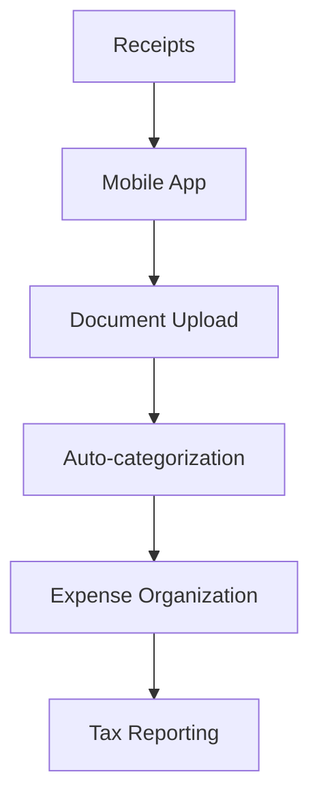

**Category:** Bookkeeping & Financial Management
**Difficulty:** Intermediate
**Reading time:** 6 min read

---

Shoeboxed is a receipt management and mileage tracking platform that helps individuals and small businesses organize financial documentation. It provides mobile receipt scanning, receipt organization, and expense categorization for tax preparation and financial management.

- **Receipt Scanning** — mobile photography and uploading
- **Automatic Categorization** — expense category assignment
- **Mileage Tracking** — automatic business mileage logging
- **Tax Organization** — organizing receipts by tax category
- **Reporting** — expense reports for tax purposes

Shoeboxed provides a mobile-first approach to receipt management designed for individuals and small business owners. Users photograph receipts using the Shoeboxed mobile app, which stores them in a digital cloud repository. The system uses OCR to extract receipt details when available. Receipts are automatically categorized based on vendor type and can be manually adjusted. The platform maintains organized folders for different expense categories facilitating tax preparation. Shoeboxed also tracks business mileage through GPS-enabled automatic logging or manual entry. The system generates expense reports by tax category, making it easy to provide information to accountants. Reports can be exported to spreadsheets or shared with tax professionals.

- Organizing receipts for tax preparation
- Tracking business expenses for deduction purposes
- Maintaining mileage logs for business use
- Creating organized expense records
- Preparing documentation for tax professionals

| Advantage | Disadvantage |
|-----------|--------------|
| Very affordable | Limited accounting integration |
| Easy mobile app | No approval workflows |
| Good for sole proprietors | Simpler features |
| Mileage tracking | Manual categorization often needed |
| Cloud storage | Limited for complex businesses |

- [Neat receipt management](neat-receipt-management.md)
- [Zoho Expense tracking](zoho-expense-tracking.md)
- [QuickBooks Expense tracking](quickbooks-expense-tracking.md)

---
*Part of the [Bookkeeping & Financial Management](bookkeeping-financial-management/index.md) category · [Back to Master Index](../../index.md)*
