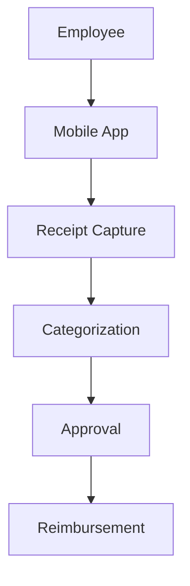

**Category:** Bookkeeping & Financial Management
**Difficulty:** Intermediate
**Reading time:** 6 min read

---

Zoho Expense is a cloud-based expense management solution that enables automated receipt capture, expense tracking, and reimbursement processing. Part of the broader Zoho suite, it integrates with other Zoho applications and provides affordable expense management for small and mid-sized businesses.

- **Mobile Expense Capture** — receipt scanning via smartphone
- **Receipt Management** — OCR and digital filing
- **Approval Workflows** — configurable approval chains
- **Reimbursement** — automated payment processing
- **Reporting** — expense analytics and dashboards

Zoho Expense provides a mobile-first approach to expense management. Employees capture receipt photos using the Zoho Expense app immediately after purchase. The platform uses OCR to automatically extract receipt details including vendor, amount, date, and category. Users can review the extracted data and make corrections if needed. Expenses are automatically categorized based on patterns and user-defined rules. Reports route through customizable approval chains where managers review and approve expenses. Once approved, the system can process reimbursements directly to employee bank accounts or generate accounting entries. The platform integrates with other Zoho applications including Books (accounting), CRM, and Projects, enabling unified financial management. Reports provide visibility into spending by category, department, and employee.

- Capturing and managing employee expenses in SMBs
- Automating expense report approval workflows
- Digitizing receipt management and archival
- Processing quick reimbursements to employees
- Integrating expense tracking with Zoho accounting apps

| Advantage | Disadvantage |
|-----------|--------------|
| Very affordable pricing | Limited integration outside Zoho |
| Easy mobile app | Simpler reporting compared to enterprise |
| Quick implementation | Smaller feature set |
| Good OCR accuracy | Less customization flexibility |
| Zoho ecosystem integration | Limited approval complexity options |

- [QuickBooks Expense tracking](quickbooks-expense-tracking.md)
- [Emburse expense software](emburse-expense-software.md)
- [Brex expense management](brex-expense-management.md)

---
*Part of the [Bookkeeping & Financial Management](bookkeeping-financial-management/index.md) category · [Back to Master Index](../../index.md)*
