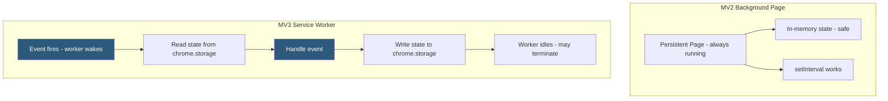

**Category:** Browser Extension & Plugin Platforms
**Difficulty:** Intermediate
**Reading time:** 6 min read

---

Background scripts are the central coordination layer of a browser extension, handling events, managing state, and orchestrating communication between content scripts, extension pages, and browser APIs. Manifest V3 replaced persistent background pages with ephemeral service workers, fundamentally changing how background logic must be structured.

- **Background Page (MV2)** — A persistent hidden HTML page running indefinitely while the browser is open, maintaining in-memory state freely
- **Service Worker (MV3)** — An event-driven background script that terminates when idle and restarts on new events, requiring externalizing state to `chrome.storage`
- **Event Listener Registration** — All event listeners must be registered synchronously at the top level of the service worker script, before any async operations
- **State Persistence** — In MV3, any state that must survive worker termination must be written to `chrome.storage`; in-memory variables are lost
- **chrome.alarms** — The recommended scheduling mechanism for recurring background tasks, surviving worker termination
- **Startup Initialization** — The pattern of reading state from `chrome.storage` at worker startup to restore the context needed for event handling
- **chrome.runtime.onInstalled** — Event fired on extension install, update, or Chrome update; common place for one-time setup tasks
- **Long-running Operations** — Operations that may exceed the service worker's 30-second idle timeout require breaking into alarm-driven segments or using `chrome.offscreen`

In Manifest V2, the background page is a standard HTML page loaded once and kept alive. Extensions could freely use `setInterval`, maintain objects in global scope, and use `XMLHttpRequest` with persistent state. This simplicity came at the cost of memory: every Chrome user with an MV2 extension keeps a hidden renderer process alive.

In MV3, the service worker must handle the same responsibilities within a stateless, termination-tolerant architecture. The worker script runs from the top on every wake-up. This means all event listener registration (`chrome.runtime.onMessage.addListener(...)`, `chrome.alarms.onAlarm.addListener(...)`) must happen at the top level, not inside async callbacks or dynamic imports — Chrome dispatches events before async setup can complete.

State management requires explicit persistence. A common pattern: on worker startup, call `chrome.storage.local.get(['appState'])` to load the previous state. Handle events by updating the in-memory copy and writing changes back with `chrome.storage.local.set({appState: newState})` before the handler returns. Do not assume the state survives between events.

For periodic tasks (polling an API every 5 minutes), `chrome.alarms.create('pollAlarm', {periodInMinutes: 5})` fires a persistent alarm even after worker termination. The `chrome.alarms.onAlarm` listener handles it and re-wakes the worker.

Long-running operations like audio playback or WebSocket connections cannot survive service worker termination. `chrome.offscreen.createDocument()` (MV3 API) creates a hidden document that can maintain a long-lived WebSocket or audio context while the service worker sleeps.

- Polling a REST API every 10 minutes using `chrome.alarms` to check for new notifications and badge the extension icon
- Caching authenticated session tokens in `chrome.storage.local` to avoid re-authentication on every service worker wake
- Coordinating messages between multiple content script instances in different tabs from a central service worker hub
- Reacting to tab navigation events (`chrome.tabs.onUpdated`) to update the extension badge based on the URL of the active tab
- Using `chrome.runtime.onInstalled` to set up default user preferences in `chrome.storage.sync` on first install

| Advantage | Disadvantage |
|-----------|--------------|
| MV3 service worker reduces persistent memory usage across all users | Stateless architecture requires refactoring all extensions relying on in-memory state |
| Alarm-based scheduling survives browser restarts automatically | Service worker termination can interrupt network requests mid-flight |
| chrome.offscreen API handles the minority of long-running use cases | Offscreen document is a workaround with added complexity, not a clean solution |
| Event-driven model aligns with web service worker standards | Worker startup latency (50–200ms) is noticeable for time-sensitive event handling |

- [Chrome Extension Service Workers](chrome-extension-service-workers.md)
- [Chrome Extension Manifest V3](chrome-extension-manifest-v3.md)
- [Content Scripts Injection](content-scripts-injection.md)
- [Extension Storage API](extension-storage-api.md)

---
*Part of the [Browser Extension & Plugin Platforms](index.md) category · [Back to Master Index](../../index.md)*
