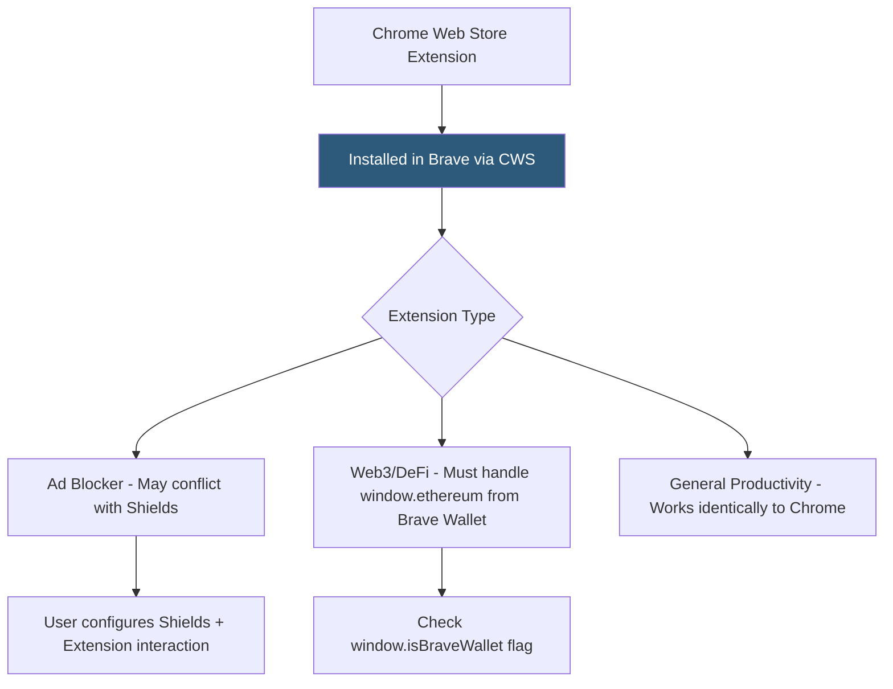

**Category:** Browser Extension & Plugin Platforms
**Difficulty:** Beginner
**Reading time:** 5 min read

---

Brave is a Chromium-based privacy-focused browser that supports Chrome extensions installed directly from the Chrome Web Store. Brave does not maintain its own extension store; instead, it leverages the existing Chrome ecosystem while adding its own built-in features (Shields, Brave Rewards, Brave Wallet) that extensions can optionally integrate with.

- **Chrome Web Store Compatibility** — Brave users install extensions from the Chrome Web Store using the same process as Chrome; no separate Brave store exists
- **Brave Shields** — Built-in ad and tracker blocking; extensions may conflict with or complement Shields depending on their purpose
- **Brave Rewards (BAT)** — Basic Attention Token tipping system; extensions can prompt users to tip websites but cannot directly integrate with BAT programmatically
- **Brave Wallet** — Built-in Ethereum and multi-chain crypto wallet injecting `window.ethereum`; web3 extensions must handle Brave Wallet's presence
- **Manifest V2 Extended Support** — Brave historically extended MV2 support longer than Chrome, giving adblocker extension developers more time to migrate
- **Component Extensions** — Extensions built into Brave itself (like its HTTPS Everywhere replacement) not from the store
- **Privacy Budget** — Brave implements anti-fingerprinting protections that may affect extension behavior relying on canvas or audio APIs for fingerprinting
- **Tor Mode** — Brave's private window with Tor routing; extensions do not run in Tor windows by default for privacy

Brave's Chromium base means the extension runtime is virtually identical to Chrome's. Chrome extension APIs, the Manifest V3 service worker model, content scripts, and messaging all behave the same way. Users point their Brave browser at `chrome.google.com/webstore`, click Install, and the extension installs exactly as it would in Chrome.

The primary compatibility consideration is Brave's Shields system. When an extension like uBlock Origin is installed alongside Brave Shields, both may block overlapping resources, causing double-blocking that doesn't harm functionality but wastes CPU cycles. Some extensions may need to detect Shields status, though there is no public API for this.

Web3 and crypto extensions face a specific challenge: Brave injects its own `window.ethereum` provider for Brave Wallet. MetaMask and similar wallet extensions also inject `window.ethereum`. When both are present, the last one to inject wins, causing conflicts. Brave sets `window.ethereum.isBraveWallet = true` as a detection flag; extension developers should check for this and handle the conflict gracefully (e.g., prompt the user to disable one wallet).

Brave's anti-fingerprinting protections randomize canvas, WebGL, AudioContext, and other APIs that fingerprinters use. Extensions relying on these APIs for legitimate purposes (e.g., generating consistent user IDs) may receive inconsistent results. This is intentional Brave behavior, not a bug.

Brave historically kept MV2 support active beyond Chrome's deprecation timeline, giving privacy extension developers (particularly ad blockers using blocking webRequest) more runway for migration. Brave's policy is generally more extension-developer-friendly than Google's.

- Reaching Brave's privacy-conscious user base (~70 million monthly active users) via normal Chrome Web Store submissions
- Building web3 DeFi dashboard extensions that detect and handle both MetaMask and Brave Wallet coexistence
- Testing privacy extensions against Brave's anti-fingerprinting protections before Chrome deployment
- Developing extensions that complement Brave Shields rather than duplicating its functionality
- Targeting cryptocurrency enthusiasts via Brave's BAT-aware user segment with crypto-related extension features

| Advantage | Disadvantage |
|-----------|--------------|
| No separate store — existing Chrome Web Store listing reaches Brave users | No Brave-specific store analytics; install counts not separated |
| Chrome API compatibility means zero code changes for most extensions | Brave Wallet `window.ethereum` injection conflicts with web3 extensions |
| Privacy-focused user base highly engaged with security/privacy tools | Anti-fingerprinting breaks extensions using canvas APIs for legitimate purposes |
| Extended MV2 support gave developers migration flexibility | No official Brave extension partnership or featured placement program |

- [Chrome Web Store Publishing](chrome-web-store-publishing.md)
- [Chrome Extension APIs](chrome-extension-apis.md)
- [WebExtensions API Standard](webextensions-api-standard.md)
- [Opera Add-ons Platform](opera-add-ons-platform.md)

---
*Part of the [Browser Extension & Plugin Platforms](index.md) category · [Back to Master Index](../../index.md)*
