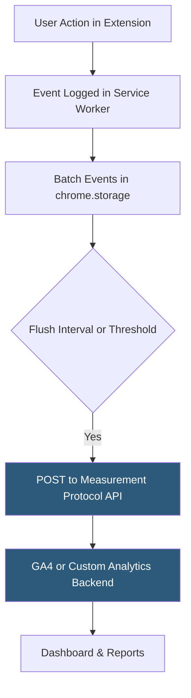

**Category:** Browser Extension & Plugin Platforms
**Difficulty:** Intermediate
**Reading time:** 5 min read

---

Analytics for Chrome extensions combines built-in Chrome Web Store metrics (installs, uninstalls, ratings) with custom event tracking using third-party analytics SDKs integrated into extension pages and service workers. Understanding user behavior within an extension requires working around the privacy constraints that prevent standard web analytics scripts from running in extension contexts.

- **Chrome Web Store Stats** — The built-in dashboard providing weekly install count, uninstall count, active users, and rating breakdown per extension
- **Weekly Active Users (WAU)** — The primary engagement metric reported by the Chrome Web Store, counting users who opened Chrome with the extension enabled
- **Google Analytics 4 (GA4)** — The most common third-party analytics SDK adapted for extension use via the Measurement Protocol HTTP API
- **Measurement Protocol** — GA4's server-side event ingestion API that extensions use to send events as HTTP POST requests instead of using the JavaScript tag
- **Event Schema** — Custom event names and parameters defined by the developer to track meaningful user actions (feature used, upgrade clicked, error occurred)
- **Privacy Considerations** — Extension analytics must comply with GDPR/CCPA; data collection requires disclosure in the privacy policy and optionally a consent prompt
- **Error Tracking** — Using `chrome.runtime.onInstalled`, try/catch blocks, and tools like Sentry to capture extension crashes and exceptions
- **Funnel Analysis** — Tracking conversion from install → feature use → upsell prompt → payment to optimize the monetization funnel

Standard GA4 JavaScript snippets do not work in extension service workers because workers lack a DOM and cannot load gtag.js. Instead, extensions use the GA4 Measurement Protocol: the extension constructs JSON event payloads and sends them as HTTP POST requests to `https://www.google-analytics.com/mp/collect` with the API key and measurement ID.

Because service workers can terminate unexpectedly, extensions that need reliable event delivery batch events in `chrome.storage.local` and flush them on the next service worker wake-up or after accumulating enough events. This prevents event loss from worker termination mid-send.

Tracking unique users requires generating a stable anonymous client ID stored in `chrome.storage.local`. This ID should not be tied to any personal identifier; it exists solely to associate sessions from the same browser instance.

The Chrome Web Store Developer Dashboard provides basic metrics weekly: total installs, active installs (users who used Chrome with extension enabled), uninstall count, and rating distribution. These are available without any custom instrumentation. Trends in these metrics combined with custom funnel analytics give a complete picture.

For error monitoring, integrations with Sentry or Bugsnag work by POSTing error events to their ingestion APIs from the service worker, similar to Measurement Protocol usage. The `self.onerror` and `self.onunhandledrejection` event handlers in the service worker capture uncaught errors.

- Tracking which features are used most to prioritize development work — POST custom events to GA4 Measurement Protocol
- Monitoring uninstall rate spikes after an update as a signal that the update caused a regression
- Analyzing the freemium conversion funnel from install to payment using event sequences
- Catching service worker crashes by integrating Sentry error reporting with `self.onerror`
- Correlating Chrome Web Store WAU trends with feature release dates to attribute growth

| Advantage | Disadvantage |
|-----------|--------------|
| Measurement Protocol provides flexible custom event tracking | No standard SDK — requires custom implementation for each analytics tool |
| Chrome Web Store provides free baseline install/uninstall metrics | Store metrics are weekly only; no real-time data available |
| Client ID in storage gives stable anonymous user identity | Storage-based ID is deleted if user uninstalls and reinstalls |
| Batching events in storage prevents loss from worker termination | Batch approach adds latency to event delivery |

- [Chrome Web Store Publishing](chrome-web-store-publishing.md)
- [Chrome Extension Monetization](chrome-extension-monetization.md)
- [Chrome Extension Service Workers](chrome-extension-service-workers.md)
- [Extension User Reviews Management](extension-user-reviews-management.md)

---
*Part of the [Browser Extension & Plugin Platforms](index.md) category · [Back to Master Index](../../index.md)*
