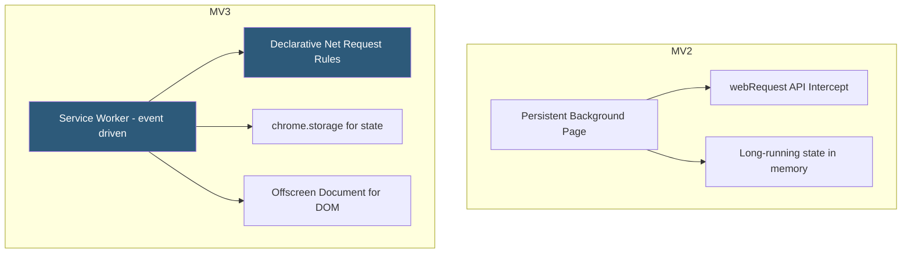

**Category:** Browser Extension & Plugin Platforms
**Difficulty:** Intermediate
**Reading time:** 6 min read

---

Manifest V3 (MV3) is Chrome's third major extension platform specification, replacing Manifest V2 with a security-first architecture that shifts background processing from persistent pages to event-driven service workers and restricts runtime code execution. Google began requiring new extensions to use MV3 in 2022 and deprecated MV2 support progressively through 2024–2025.

- **Service Worker** — The MV3 replacement for background pages; a short-lived event handler that terminates when idle and restarts on demand
- **Declarative Net Request (DNR)** — The MV3 API for content blocking that uses static rule sets instead of intercepting requests in JavaScript
- **Host Permissions** — URL patterns granting access to specific websites, now separated from API permissions in MV3
- **Remote Code Execution Ban** — MV3 prohibits loading and executing JavaScript fetched at runtime, requiring all logic to be bundled at install time
- **Action API** — Unified replacement for `browser_action` and `page_action`, controlling the extension toolbar button
- **Promise-based APIs** — MV3 modernizes most Chrome APIs to return Promises natively, reducing callback nesting
- **Content Security Policy** — Stricter default CSP in MV3 blocks eval() and inline script execution in extension pages
- **Offscreen Documents** — MV3 API allowing extensions to run DOM operations in a hidden document when service workers cannot access the DOM

In MV3, when Chrome launches the browser or encounters a triggering event (a navigation, a message, an alarm), it spins up the extension's service worker. The worker handles the event, then Chrome terminates it after a few seconds of inactivity to free memory. This means extensions cannot keep state in global variables — all persistent data must go through `chrome.storage`.

The Declarative Net Request API moves content blocking logic out of JavaScript into a JSON rule set bundled with the extension. Chrome evaluates rules natively in the browser engine without running extension code per-request, dramatically improving performance and privacy since the extension never sees individual request URLs.

The remote code ban prevents extensions from fetching and eval-ing JavaScript from external servers — a technique previously exploited to inject malicious logic post-review. All executable code must be present at install time, making extension behavior auditable at review.

APIs like `chrome.tabs`, `chrome.webRequest` (now read-only for most extensions), and messaging remain but now return Promises by default. Extensions that relied on blocking webRequest for ad-blocking must migrate to DNR, which supports up to 30,000 static rules and 1,000 dynamic rules per extension.

- Ad blockers migrating to DNR for performant, privacy-preserving request filtering without reading all URLs
- Password managers using service workers to handle autofill events without a persistent background page overhead
- Developer tools extensions using offscreen documents to parse HTML content outside of visible pages
- Enterprise policy extensions declaring static host permissions separately from API permissions for granular IT governance
- Security audits leveraging the remote code ban to confirm reviewed extension behavior cannot change post-install

| Advantage | Disadvantage |
|-----------|--------------|
| Service worker termination reduces memory footprint | Extensions relying on persistent state require significant refactoring |
| DNR blocking is faster and more privacy-preserving | DNR rule limits constrain complex ad-block filter lists |
| Remote code ban prevents post-install injection attacks | Cannot dynamically load helper libraries at runtime |
| Promise-based APIs align with modern async JavaScript | Offscreen document API is a workaround, not a clean solution |

- [Chrome Web Store Publishing](chrome-web-store-publishing.md)
- [Chrome Extension APIs](chrome-extension-apis.md)
- [Chrome Extension Service Workers](chrome-extension-service-workers.md)
- [Chrome Extension Security Policies](chrome-extension-security-policies.md)

---
*Part of the [Browser Extension & Plugin Platforms](index.md) category · [Back to Master Index](../../index.md)*
