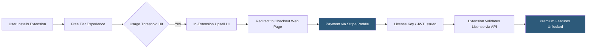

**Category:** Browser Extension & Plugin Platforms
**Difficulty:** Intermediate
**Reading time:** 5 min read

---

Monetizing a Chrome extension involves several strategies including freemium upgrades, subscription payments, one-time purchases, and advertising — each with different implementation complexity and revenue potential. Google deprecated its Chrome Web Store Payments API, so most paid extensions now integrate third-party billing providers like Stripe or Paddle.

- **Freemium Model** — Free core functionality with paid upgrades unlocking advanced features, the most common extension monetization pattern
- **License Key Activation** — Backend-validated keys sold through third-party stores (Gumroad, Paddle) and checked against an API at extension startup
- **Subscription Billing** — Recurring payment via a web checkout flow external to the extension, with license status verified via API
- **In-Extension Upsell** — UI within the extension popup prompting free users to upgrade, displayed based on usage thresholds
- **Trial Period** — Time-limited or feature-limited free access before requiring payment, tracked via `chrome.storage` with server-side validation
- **User Acquisition Cost** — Cost of acquiring an install, relevant when buying ads or featured placement to drive users into a freemium funnel
- **Affiliate / Referral Model** — Extension earns commissions by surfacing affiliate links (common in coupon and shopping extensions)
- **B2B Enterprise Licensing** — Per-seat or site licenses sold to companies, often distributed via Chrome policy without store publishing

Since Chrome Web Store Payments was retired in 2020, extensions cannot process payments inside the browser directly through Google's infrastructure. Instead, extensions redirect users to an external HTTPS checkout page — typically hosted on the developer's domain — where a payment processor like Stripe or Paddle handles the transaction.

After payment, the merchant platform issues a license token (JWT or API key). The user enters this in the extension's options page or the checkout flow deep-links back to the extension via `chrome.runtime.id`-based redirect URIs. The extension stores the token in `chrome.storage.local` and validates it against the developer's API on startup.

Freemium gating is enforced entirely in extension code, but since extension code is visible to determined users, server-side validation of premium status is necessary for anything beyond cosmetic features. The extension sends a request to the developer's backend with the stored license token; the backend confirms validity and returns permission flags.

For the affiliate model (used by Honey, Capital One Shopping, etc.), the extension injects affiliate parameters or redirects through affiliate URLs when users visit partner merchant sites. This generates commissions without requiring users to pay anything — revenue comes from merchants.

- SaaS tool extensions (writing assistants, SEO tools) using a monthly subscription validated against a backend JWT
- Developer tools charging a one-time license fee via Gumroad, with key validation on extension startup
- Shopping extensions earning affiliate commissions by rewriting URLs with tracked referral codes
- B2B productivity extensions sold per-seat through a company dashboard, with license enforcement via domain-based authentication
- Consumer privacy tools offering a free ad-block tier and a paid "enhanced privacy" tier with additional features

| Advantage | Disadvantage |
|-----------|--------------|
| Freemium lowers acquisition barrier while capturing high-intent buyers | License keys can be shared; server-side validation adds infrastructure cost |
| No platform revenue share — developer keeps 100% minus payment fees | No built-in billing UI; must maintain external checkout and subscription management |
| Affiliate model monetizes without charging users | Affiliate model creates conflicts of interest and risks policy violations |
| B2B licensing yields higher ARPU than consumer subscriptions | Enterprise sales cycles are long; hard to scale without a dedicated sales team |

- [Chrome Web Store Publishing](chrome-web-store-publishing.md)
- [Chrome Extension Analytics](chrome-extension-analytics.md)
- [Chrome Extension Review Process](chrome-extension-review-process.md)
- [Extension User Reviews Management](extension-user-reviews-management.md)

---
*Part of the [Browser Extension & Plugin Platforms](index.md) category · [Back to Master Index](../../index.md)*
