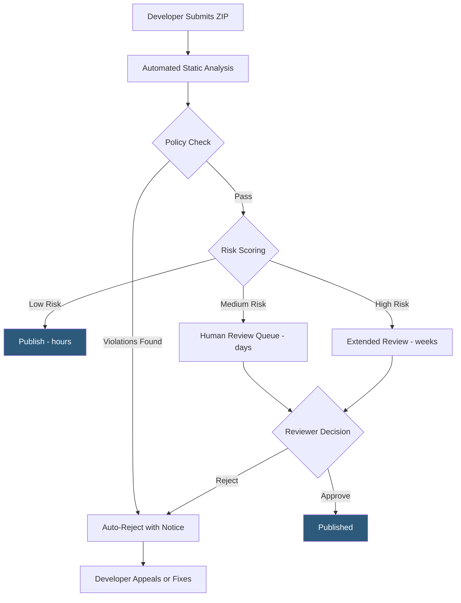

**Category:** Browser Extension & Plugin Platforms
**Difficulty:** Beginner
**Reading time:** 5 min read

---

Every extension submitted to the Chrome Web Store undergoes both automated and human review to verify it complies with Google's Developer Program Policies before being made available to users. Review times range from hours for low-risk extensions to several weeks for complex or high-permission submissions.

- **Developer Program Policies** — Google's rules governing acceptable extension behavior, including single-purpose, minimum permission, and no deceptive content requirements
- **Automated Review** — Static analysis and policy checks run immediately on upload, catching common violations like remote code, banned permissions, or malware signatures
- **Human Review** — Manual assessment by Google's review team for higher-risk submissions or automated escalations
- **Review Queue** — A FIFO-like queue for human review; extensions with sensitive permissions enter longer queues
- **Rejection Notice** — Email notification with the specific policy violation cited; no phone support is available
- **Appeal Process** — Developers can appeal rejections via the Developer Dashboard; appeals are reviewed by a separate team
- **Staged Rollout** — Feature allowing published updates to be delivered to a percentage of users before full release, reducing review risk impact
- **Policy Enforcement Action** — Google can remove a live extension from the store or disable it in all browsers for policy violations

After upload, Google's pipeline unpacks the extension ZIP and runs automated checks: manifest schema validation, banned API detection, obfuscated code detection (prohibited), remote-hosted code checks, and malware signature scanning. Extensions that fail these checks are auto-rejected with a policy code in the notification email.

Extensions passing automation receive a risk score based on factors including requested permissions (host access breadth, sensitive APIs), extension category, developer account history, and code complexity. Low-risk extensions — simple tools with narrow permissions from developers with good track records — often publish in under 24 hours.

High-risk extensions enter a human review queue. Reviewers test the extension's declared functionality, verify screenshots match behavior, check privacy policy URLs are accessible, and manually inspect the code for policy violations. Google does not publish queue lengths or SLA times, so developers cannot predict review duration.

Updates to published extensions also require review. Minor version bumps to fix bugs typically clear faster than updates adding new permissions. Adding a permission in an update triggers a re-review at the same risk level as a new submission.

Policy enforcement can happen post-publish. Google's trust and safety systems monitor live extensions for behavior changes and user reports. An extension can be disabled globally or removed from all installations via a kill switch Google controls, called the "extension blocklist."

- Pre-submission testing against Google's Policy FAQ to reduce rejection risk before uploading
- Tracking review status via the Developer Dashboard's status column (In Review, Published, Rejected)
- Appealing a rejection when automated review incorrectly flags legitimate functionality as a violation
- Planning update release schedules around expected review times for time-sensitive feature launches
- Using unlisted status to share with beta testers without entering the public review queue

| Advantage | Disadvantage |
|-----------|--------------|
| Automated review prevents most malware from reaching users | No SLA guarantee; reviews can block urgent security patches for weeks |
| Clear policy documentation reduces ambiguous rejections | Rejection notices often lack enough detail to diagnose the exact issue |
| Appeal process provides recourse for incorrect rejections | Appeals add further delay with no guaranteed outcome |
| Post-publish monitoring protects users from compromised extensions | Kill switch means Google can disable your extension for all users unilaterally |

- [Chrome Web Store Publishing](chrome-web-store-publishing.md)
- [Chrome Extension Security Policies](chrome-extension-security-policies.md)
- [Chrome Extension Monetization](chrome-extension-monetization.md)
- [Extension Privacy Policies](extension-privacy-policies.md)

---
*Part of the [Browser Extension & Plugin Platforms](index.md) category · [Back to Master Index](../../index.md)*
