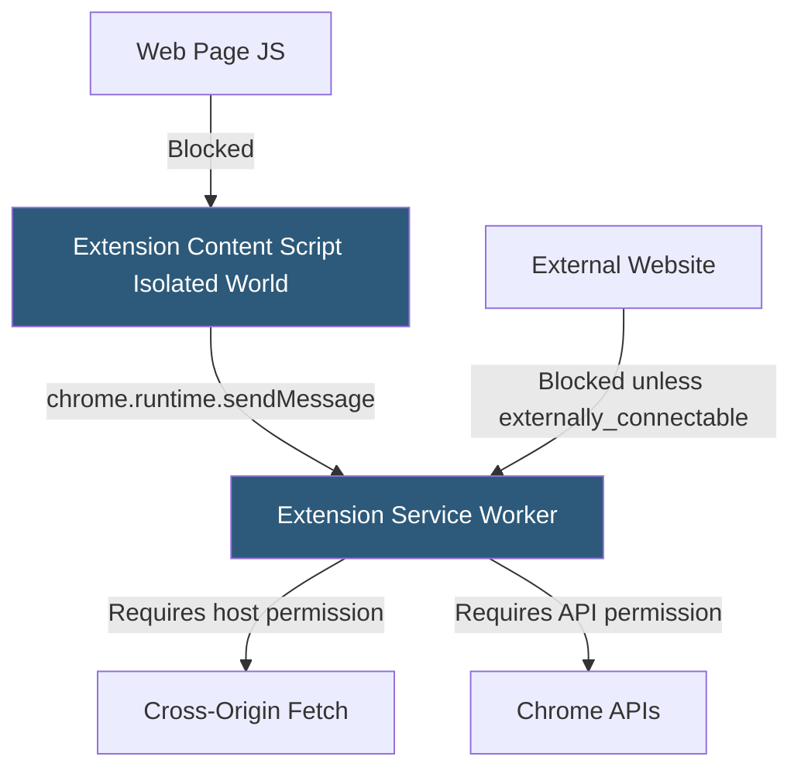

**Category:** Browser Extension & Plugin Platforms
**Difficulty:** Advanced
**Reading time:** 7 min read

---

Chrome extensions operate in a privileged context with access to sensitive browser APIs, making security policy enforcement critical. Chrome enforces multiple layered protections including Content Security Policy, isolated worlds, origin permissions, and the Manifest V3 remote code execution ban to contain the blast radius of a compromised or malicious extension.

- **Isolated World** — A separate JavaScript execution context injected into web pages for content scripts, preventing page scripts from accessing extension variables or vice versa
- **Content Security Policy (CSP)** — A per-extension policy controlling which scripts, styles, and resources can execute in extension pages (popup, options, etc.)
- **Cross-Origin Permission** — Explicit host permission (`<all_urls>` or specific patterns) required before content scripts or background scripts can fetch from or inject into a given origin
- **Extension Origin** — The unique `chrome-extension://<id>` scheme origin assigned to each extension, enforcing same-origin restrictions on extension resources
- **Remote Code Execution Ban** — MV3 policy prohibiting execution of externally fetched JavaScript, preventing post-install code injection
- **eval() Restriction** — CSP default blocks `eval()` and `new Function()` in extension pages, eliminating a common XSS vector
- **Minimum Permission Principle** — Google's policy requiring extensions to declare only the narrowest permission set needed, reviewers reject over-privileged manifests
- **Externally Connectable** — Manifest field that controls which web pages are allowed to send messages to the extension

Chrome runs content scripts in an "isolated world" — the script shares the DOM with the page but has a completely separate JavaScript heap. The web page cannot read variables from the content script, and the content script cannot read variables set by the page, preventing the page from exfiltrating extension tokens or hijacking extension behavior.

Extension pages (popups, options, background) run under the `chrome-extension://` origin. Chrome's renderer enforces same-origin policy on these pages. The default CSP for MV3 extension pages is `script-src 'self'; object-src 'self'`, blocking inline scripts, eval, and remote script imports. Developers can relax this by adding specific hashes for inline scripts but cannot allow arbitrary eval.

Host permissions gate both cross-origin fetch from service workers and content script injection. An extension declaring `"host_permissions": ["https://example.com/*"]` can inject scripts into `example.com` pages and make `fetch()` calls to `example.com` from any extension context without CORS restrictions. Without the declaration, those operations fail silently or throw.

The `externally_connectable` manifest field is a security boundary controlling which web origins can call `chrome.runtime.sendMessage` to reach the extension. Without this field, only extension components can message each other. Misconfigured broad patterns (e.g., `*://*/*`) effectively give any website the ability to invoke extension functionality.

- Auditing extensions for CSP violations to detect eval usage that could be exploited for XSS
- Restricting externally_connectable to specific trusted domains to prevent CSRF-style extension attacks
- Using isolated worlds to safely read page DOM content without exposing extension logic to untrusted page scripts
- Scoping host permissions to only required domains to limit damage if the extension is compromised
- Enterprise IT evaluating extensions for least-privilege permission sets before allowing deployment via Chrome policy

| Advantage | Disadvantage |
|-----------|--------------|
| Isolated worlds prevent page-to-extension prototype pollution | Content scripts still share DOM, enabling DOM clobbering attacks |
| CSP blocks most eval-based XSS in extension pages | Strict CSP complicates integrating third-party UI libraries |
| Host permission model gives users clear data-access visibility | Broad permissions like <all_urls> still approved for legitimate use cases |
| Externally_connectable limits attack surface from web pages | Poorly configured field creates cross-origin message injection risk |

- [Chrome Extension Manifest V3](chrome-extension-manifest-v3.md)
- [Extension Permissions Model](extension-permissions-model.md)
- [Extension CSP (Content Security Policy)](extension-csp-content-security-policy.md)
- [Content Scripts Injection](content-scripts-injection.md)

---
*Part of the [Browser Extension & Plugin Platforms](index.md) category · [Back to Master Index](../../index.md)*
