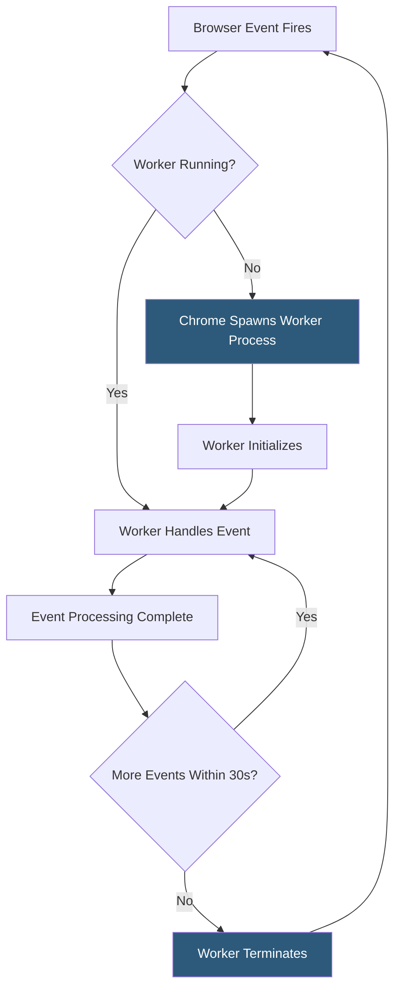

**Category:** Browser Extension & Plugin Platforms
**Difficulty:** Intermediate
**Reading time:** 6 min read

---

In Manifest V3, Chrome extensions use a service worker as the background context that handles extension events, replaces the persistent background page of MV2. Unlike web service workers, extension service workers have access to all Chrome extension APIs but share the same ephemeral lifecycle — terminating after idle and restarting when a new event arrives.

- **Ephemeral Lifecycle** — The service worker is spun up on demand and terminated after roughly 30 seconds of inactivity to conserve memory
- **Event-Driven Architecture** — All logic must be triggered by events (tab updates, messages, alarms) rather than running continuously
- **chrome.alarms** — The recommended mechanism for recurring tasks since setTimeout/setInterval do not survive worker termination
- **chrome.storage** — Required for any state that must persist between worker lifetimes; in-memory variables are lost on termination
- **Top-Level Await** — Extension service workers support top-level await, enabling cleaner async initialization patterns
- **importScripts** — Synchronous script import function usable in service workers for loading shared utility modules
- **Worker Startup Latency** — The delay (typically 50–200ms) Chrome incurs waking a terminated service worker on a new event
- **keepAlive Workaround** — Unofficial technique (e.g., opening a port connection) to prevent termination, discouraged by Google

Chrome registers the extension service worker by reading the `background.service_worker` field in `manifest.json`. On extension install or browser startup, Chrome activates the worker once to fire `chrome.runtime.onInstalled`. After the handler completes and no other events arrive, Chrome terminates the worker.

When a new event occurs — a navigation triggers `chrome.tabs.onUpdated`, a message arrives via `chrome.runtime.onMessage`, or a `chrome.alarms` alarm fires — Chrome wakes the worker. This wake-up involves forking a renderer process (if not already cached), running the service worker script from the top, re-registering all event listeners, and then dispatching the event. This is why registering listeners must happen synchronously at the top level of the script, not inside async callbacks.

The worker communicates with content scripts through `chrome.runtime.sendMessage` / `onMessage`. Long-lived connections are maintained with ports (`chrome.runtime.connect`), but a port from a content script does not prevent worker termination — the worker must use an alarm or other mechanism to stay alive if needed.

State that must persist uses `chrome.storage`, which is asynchronous but durable. A common pattern initializes variables by reading from storage in the worker's startup path, handles events, writes back changes, then lets the worker idle out safely.

- Handling background data syncs triggered by `chrome.alarms` every 15 minutes without keeping the worker alive continuously
- Processing incoming messages from content scripts to coordinate cross-tab state via `chrome.storage`
- Intercepting `chrome.tabs.onUpdated` events to badge the extension icon based on the active page URL
- Authenticating API calls on behalf of content scripts, with credentials stored in `chrome.storage.local`
- Reacting to browser startup with `chrome.runtime.onStartup` to pre-warm caches in storage

| Advantage | Disadvantage |
|-----------|--------------|
| Zero memory footprint when idle compared to persistent pages | Every wake-up adds 50–200ms startup latency |
| Forced stateless architecture improves extension reliability | Developers must refactor all persistent-state logic |
| Aligned with web service worker standards for developer familiarity | importScripts is synchronous — large scripts block worker startup |
| Alarms API provides reliable scheduling across restarts | 30-second idle timeout can interrupt long-running operations |

- [Chrome Extension Manifest V3](chrome-extension-manifest-v3.md)
- [Chrome Extension APIs](chrome-extension-apis.md)
- [Background Scripts Architecture](background-scripts-architecture.md)
- [Extension Storage API](extension-storage-api.md)

---
*Part of the [Browser Extension & Plugin Platforms](index.md) category · [Back to Master Index](../../index.md)*
