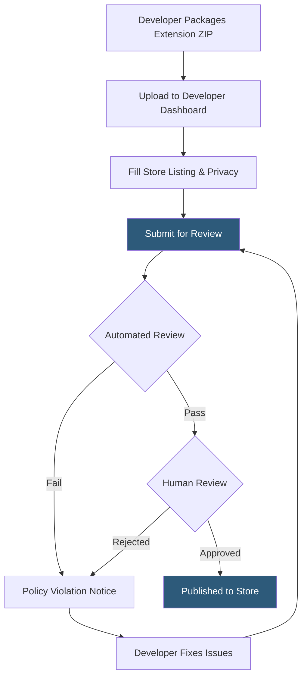

**Category:** Browser Extension & Plugin Platforms
**Difficulty:** Intermediate
**Reading time:** 6 min read

---

The Chrome Web Store is Google's official marketplace for distributing Chrome browser extensions, themes, and apps to over 3 billion Chrome users worldwide. Publishing requires submitting a packaged extension with a complete manifest, privacy disclosures, and passing an automated and manual review process before appearing publicly.

- **Developer Dashboard** — The web interface at chrome.google.com/webstore/devconsole where developers upload, manage, and monitor their extensions
- **CRX Package** — The compressed archive format (.crx) that bundles all extension files for distribution
- **Manifest V3** — The current extension manifest specification enforcing stricter security rules including service workers instead of background pages
- **Review Process** — Google's automated and human review cycle that checks for policy compliance before publishing
- **Verified Publisher** — An optional badge program confirming developer identity, increasing user trust
- **Extension Rating** — User star ratings visible on the store listing, directly impacting install conversion rates
- **Privacy Practice Declaration** — Required disclosure of what user data the extension collects and how it is used
- **Item ID** — The unique 32-character identifier assigned when an extension is first uploaded, permanent across versions

When a developer uploads a ZIP file to the Developer Dashboard, Google's ingestion pipeline unpacks and validates the manifest, checks referenced permissions against the declared privacy practices, and runs static analysis looking for obfuscated code, remote-hosted code, and policy violations such as unapproved data collection.

The automated review assigns a risk score. Low-risk submissions often publish within hours; higher-risk items enter a human review queue that can take days to weeks. Reviewers check the listing description for misleading claims, verify screenshots accurately represent the extension, and test core functionality.

Google enforces strict policies around minimum permissions: an extension requesting `<all_urls>` host permission without justification will be rejected. Single-purpose policy requires the extension to have one clearly stated purpose.

Once live, each subsequent version update also undergoes review. The store serves the extension's CRX file via Google's CDN to end users, and Chrome's built-in update mechanism polls the store periodically (roughly every few hours) to deliver new versions automatically. Developers can roll out updates to a percentage of users using staged rollouts from the dashboard.

- Distributing productivity tools (password managers, ad blockers) to mass audiences — reaches users without manual installation steps
- Shipping internal corporate tools via unlisted extensions — shareable by direct URL, not publicly indexed
- Monetizing via in-app purchases using the Chrome Web Store Payments API — handles billing and licensing
- A/B testing extension UX via staged rollouts — deploy to 5% of users before full release
- Tracking install metrics and crash rates via the Developer Dashboard analytics — catch regressions before mass impact

| Advantage | Disadvantage |
|-----------|--------------|
| Instant access to billions of Chrome users | Review delays can block urgent security patches for days |
| Built-in auto-update infrastructure via Google CDN | Policy changes may force costly extension rewrites |
| Trust signals (ratings, badges) increase install rates | One-time $5 developer fee; no revenue sharing for paid installs |
| Centralized analytics on installs, uninstalls, and errors | Limited ability to distribute pre-release builds publicly |

- [Chrome Extension Manifest V3](chrome-extension-manifest-v3.md)
- [Chrome Extension APIs](chrome-extension-apis.md)
- [Chrome Extension Review Process](chrome-extension-review-process.md)
- [Chrome Extension Monetization](chrome-extension-monetization.md)

---
*Part of the [Browser Extension & Plugin Platforms](index.md) category · [Back to Master Index](../../index.md)*
