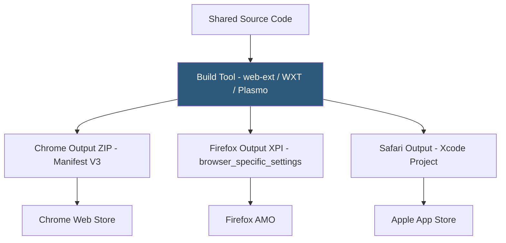

**Category:** Browser Extension & Plugin Platforms
**Difficulty:** Intermediate
**Reading time:** 6 min read

---

Cross-browser extension development involves writing a single extension codebase that runs correctly in Chrome, Firefox, Edge, Safari, and other WebExtension-compatible browsers. This requires managing namespace differences, manifest compatibility, API gaps, and browser-specific build steps through tooling and careful feature detection.

- **webextension-polyfill** — Mozilla's library wrapping `chrome.*` callback APIs in `browser.*` Promise-returning equivalents for uniform cross-browser code
- **Manifest Compatibility** — Maintaining one manifest that works across browsers, or using a build step to generate browser-specific manifests
- **Browser Detection** — Using `navigator.userAgent` or `typeof browser.specific_api` guards to enable/disable features per browser
- **web-ext** — Mozilla's CLI tool for building and linting extensions; supports outputting browser-specific ZIPs
- **Plasmo Framework** — Third-party build framework abstracting browser differences for React-based extensions
- **WXT (WebExtension Tools)** — Another framework providing Vite-based builds, TypeScript support, and cross-browser output
- **Feature Detection** — Checking API availability at runtime rather than browser-sniffing: `'contextualIdentities' in browser ? useContainers() : skip()`
- **Polyfill Strategy** — Pattern of including webextension-polyfill early in every script context to normalize the API surface before other code runs

The foundation of cross-browser development is using the `browser.*` namespace consistently. By importing `webextension-polyfill` at the top of every script (`import browser from 'webextension-polyfill'`), Chrome's callback-based APIs are wrapped in Promises, making them identical to Firefox's native `browser.*` API surface.

Manifest differences require attention: Firefox needs `browser_specific_settings.gecko.id` for reliable update tracking; Chrome ignores it harmlessly. Background workers use `"service_worker"` key in Chrome/Edge (MV3) but may need `"scripts"` array for older Firefox MV2 compatibility. Build tools like WXT can maintain a single source manifest and output browser-specific versions during the build step.

For API gaps (Firefox `contextualIdentities`, Chrome `offscreen` documents), the strategy is feature detection with graceful degradation: check if the API exists before calling it, and either disable the feature or provide an alternative implementation. Avoid user-agent sniffing as a browser-detection mechanism — it's fragile and can misidentify modern browsers.

Safari requires a dedicated build step: running `xcrun safari-web-extension-converter` to generate an Xcode project, then building with Xcode for macOS or iOS. This is fundamentally different from the ZIP packaging used by Chrome and Firefox. CI/CD pipelines for multi-browser extensions typically run Safari conversion on a macOS agent while handling Chrome/Firefox on any OS.

Testing across browsers is non-optional. Chrome and Firefox engines can have subtle behavioral differences in content script timing, storage quotas, and messaging. Automated E2E tests using Playwright (which supports multiple browser targets) can cover most scenarios.

- A productivity extension targeting 5 browsers from a single GitHub repository using WXT for browser-specific builds
- Handling Firefox container tab support as an optional feature without breaking Chrome and Edge versions
- Automated CI/CD using GitHub Actions to build and sign Chrome (upload to CWS) and Firefox (web-ext sign) on every release tag
- Detecting Brave's anti-fingerprinting by catching canvas randomization and offering an alternative ID generation strategy
- Using WXT's HMR (hot module replacement) during development to test content script changes instantly in a live browser

| Advantage | Disadvantage |
|-----------|--------------|
| Single codebase multiplies reach across all major browsers | Safari requires macOS build environment, complicating CI/CD |
| Build tools (WXT, Plasmo) abstract most browser-specific boilerplate | Framework abstraction can obscure browser API behavior during debugging |
| webextension-polyfill normalizes 90% of API differences | Polyfill cannot bridge missing APIs — gaps still need manual handling |
| Feature detection makes optional features degrade gracefully | Testing matrix grows multiplicatively with each browser target added |

- [WebExtensions API Standard](webextensions-api-standard.md)
- [Chrome Extension Manifest V3](chrome-extension-manifest-v3.md)
- [Firefox WebExtensions API](firefox-webextensions-api.md)
- [Safari Web Extensions](safari-web-extensions.md)

---
*Part of the [Browser Extension & Plugin Platforms](index.md) category · [Back to Master Index](../../index.md)*
