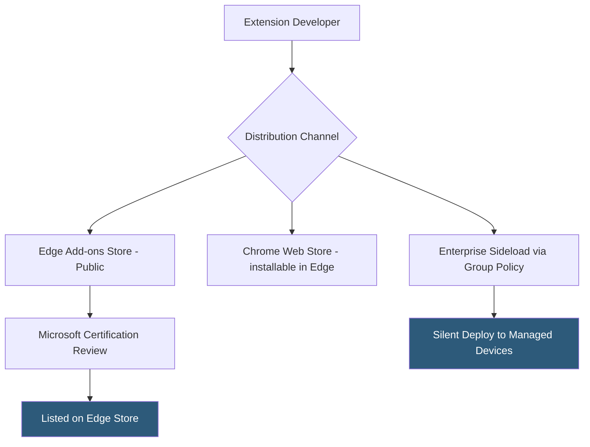

**Category:** Browser Extension & Plugin Platforms
**Difficulty:** Beginner
**Reading time:** 5 min read

---

The Microsoft Edge Add-ons store is Microsoft's official distribution platform for Edge browser extensions, launched with the Chromium-based Edge in 2020. Because Edge is built on Chromium, Chrome extensions are largely compatible with Edge, and Microsoft runs an independent review process and store separate from the Chrome Web Store.

- **Partner Center** — Microsoft's developer portal for submitting and managing Edge add-ons at partner.microsoft.com/dashboard
- **Chrome Extension Compatibility** — Edge can install extensions from the Chrome Web Store directly; the Edge Add-ons store hosts independently submitted extensions
- **Certification Process** — Microsoft's automated and manual review checking Edge-specific policies and Microsoft Store guidelines
- **Edge-Specific APIs** — A small set of APIs Microsoft adds to Edge (e.g., `browser.identity` with Microsoft account support) beyond the standard WebExtensions set
- **Sideloading Policy** — Enterprise IT can deploy extensions to managed Edge installations via group policy without store review
- **Forced Install** — Microsoft Intune and Group Policy can silently install extensions to all managed Edge browsers
- **Store Listing** — Required elements include screenshots (1280x800), category selection, and a privacy policy URL
- **Update Cadence** — Extensions update through Edge's internal update mechanism pulling from Microsoft's CDN, not the developer's server

Developers submit extensions to the Edge Add-ons store via Microsoft Partner Center. The submission accepts a ZIP file identical in format to a Chrome extension (same Manifest V3 structure), along with store listing metadata. Microsoft runs automated validation and then manual certification similar to Chrome's process, though Microsoft's policies align closely with Chrome's given shared Chromium underpinnings.

Because Edge is built on Chromium, most Chrome extensions install and run in Edge without modification. Users can browse the Chrome Web Store in Edge and install extensions from there directly. This dual-store situation means many extensions appear in both stores, sometimes maintained by the same developer, sometimes not.

Microsoft's enterprise integration is a key differentiator. Through Microsoft Endpoint Manager (Intune) and Active Directory Group Policy, IT administrators can push extensions to all managed Windows machines running Edge silently, without user interaction. The `ExtensionInstallForcelist` policy in Edge settings works like Chrome's equivalent.

Edge's `browser.identity` API integrates with Microsoft accounts and Azure Active Directory, enabling OAuth flows against Microsoft identity providers with less configuration than using the generic OAuth approach in Chrome. This is valuable for enterprise extensions authenticating with Microsoft 365 resources.

Extensions listed on the Edge Add-ons store receive a separate install count and review pool from the Chrome Web Store. Ratings and reviews do not transfer between stores even if the same extension package is submitted to both.

- Publishing enterprise Microsoft 365 productivity tools on the Edge store to reach IT-managed Windows deployments
- Force-installing compliance or security extensions on managed corporate Edge browsers via Intune without user prompt
- Reaching Edge's several hundred million users who may not install extensions from the Chrome Web Store
- Using Edge's Microsoft identity integration to build extensions that authenticate with Azure AD without OAuth redirect complexity
- Submitting the same Chrome extension package to the Edge store with minimal changes to maximize cross-browser reach

| Advantage | Disadvantage |
|-----------|--------------|
| Chromium compatibility means most Chrome extensions work without changes | Separate review process requires maintaining two store listings |
| Enterprise group policy integration for silent deployment | Smaller user base than Chrome Web Store |
| Microsoft account identity integration for enterprise use cases | Edge-specific API surface is minimal — few reasons to build Edge-only extensions |
| Free submission with no upfront developer fee | Microsoft's review SLA is not publicly documented |

- [Chrome Web Store Publishing](chrome-web-store-publishing.md)
- [WebExtensions API Standard](webextensions-api-standard.md)
- [Cross-Browser Extension Development](cross-browser-extension-development.md)
- [Extension Permissions Model](extension-permissions-model.md)

---
*Part of the [Browser Extension & Plugin Platforms](index.md) category · [Back to Master Index](../../index.md)*
