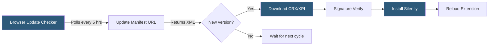

**Category:** Browser Extension & Plugin Platforms
**Difficulty:** Intermediate
**Reading time:** 6 min read

---

Browser extension auto-update mechanisms allow extensions to receive new versions silently without user intervention. Each browser store runs periodic checks against declared update URLs, compares version numbers, and downloads and installs updated CRX or XPI packages automatically. Understanding this pipeline is critical for maintaining security, compatibility, and feature delivery.

- **Update manifest** — An XML file served at the update URL listing the latest version number and package download URL
- **CRX package** — Chrome's extension packaging format, a signed ZIP archive with metadata
- **Version polling** — The browser's scheduled process of checking update manifests (typically every few hours)
- **Silent update** — Installation of a new extension version without prompting the user
- **Staged rollout** — Gradual release of an update to a percentage of users to reduce risk
- **Update suppression** — Temporary delay of auto-updates during active extension use to avoid disruption
- **Signature verification** — Browser validation of the update package against the store's signing keys
- **Forced update interval** — The maximum period before a browser forces a pending update to apply

Chrome and Chromium-based browsers check for extension updates approximately every five hours by sending requests to the update URL declared in the extension's manifest under `update_url`. For extensions hosted on the Chrome Web Store, this URL points to Google's infrastructure. Self-hosted extensions must maintain their own update manifest XML file following the Omaha protocol format, specifying the `appid`, `version`, and `codebase` (download URL).

When an update is detected, the browser downloads the new CRX package, verifies its cryptographic signature against the public key embedded in the original extension ID, and queues the installation. The update typically applies when all extension contexts (service workers, content scripts, popups) are idle or when the browser determines it safe to reload. Chrome can suppress updates if an extension is actively serving a request.

Firefox uses a similar mechanism with XPI packages and checks Mozilla's AMO servers, or a developer-specified `update_url` for self-distributed add-ons. Safari extensions distributed through the App Store rely on the standard macOS/iOS software update mechanism rather than a separate extension update channel.

Developers can test update behavior locally by setting update_url to a local server and using `chrome://extensions` developer mode's "Update extensions" button.

- Patching security vulnerabilities without waiting for users to manually update
- Rolling out new features gradually to avoid overwhelming support
- Fixing broken integrations when third-party APIs change
- Delivering compliance updates required by platform policy changes
- A/B testing new extension behaviors with staged rollouts

| Advantage | Disadvantage |
|-----------|--------------|
| Users always run the latest secure version | Developers cannot prevent rollbacks if a bug is introduced |
| Zero friction for end users | Auto-updates can break workflows if changes are not backward-compatible |
| Fast response to security incidents | Self-hosted update servers require maintenance and availability |
| Supports staged rollouts for risk mitigation | Update timing is non-deterministic from developer's perspective |

- [Chrome Extension Manifest V3](chrome-extension-manifest-v3.md)
- [Extension Version Management](extension-version-management.md)
- [Chrome Web Store Publishing](chrome-web-store-publishing.md)

---
*Part of the [Browser Extension & Plugin Platforms](index.md) category · [Back to Master Index](../../index.md)*
