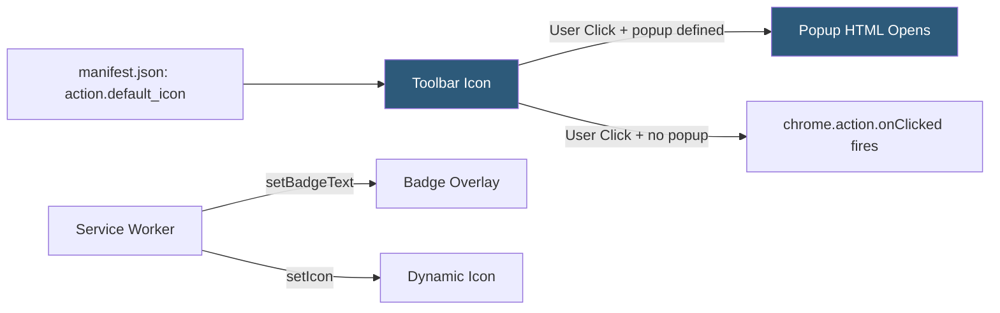

**Category:** Browser Extension & Plugin Platforms
**Difficulty:** Beginner
**Reading time:** 5 min read

---

Browser actions are the toolbar button icons that represent an extension in the browser's toolbar. They serve as the primary entry point for users to interact with an extension, opening a popup, triggering a direct action, or displaying a badge with dynamic information. In Manifest V3, the former `browser_action` and `page_action` APIs are unified under the `chrome.action` API.

- **chrome.action** — Unified MV3 API replacing both `browser_action` and `page_action` from MV2
- **Toolbar icon** — The 16×16, 32×32, 48×48, or 128×128 pixel icon displayed in the browser toolbar
- **Popup** — An HTML page that opens when the user clicks the toolbar icon
- **Badge** — Text overlay (up to 4 characters) displayed on the icon to show dynamic status
- **Badge background color** — Customizable background color for the badge via `chrome.action.setBadgeBackgroundColor`
- **onClick listener** — Fires when the icon is clicked and no popup is configured
- **chrome.action.setIcon** — Dynamically changes the toolbar icon image, useful for status indication
- **Pinned vs unpinned** — Whether the extension icon is always visible in the toolbar or hidden in the extensions menu

The action icon is declared in `manifest.json` under the `action` key with `default_icon` specifying icon file paths for multiple sizes. Chrome uses the most appropriate size for the current display density. When the `default_popup` is set to an HTML file path, clicking the icon opens that file in a popup window; Chrome handles the popup lifecycle automatically.

If no popup is configured, clicking the icon fires the `chrome.action.onClicked` event in the service worker, allowing the extension to perform a direct action like opening a tab or toggling a content script.

Badges are set programmatically via `chrome.action.setBadgeText({ text: "3" })` and are commonly used to display unread counts, error indicators, or status flags. Badges are restricted to four characters. Color customization via `chrome.action.setBadgeBackgroundColor({ color: "#FF0000" })` allows status-coded visual feedback.

The icon itself can be swapped dynamically using `chrome.action.setIcon()` with either a file path or an ImageData object, enabling visual status indicators (enabled/disabled state, sync in progress, etc.).

`chrome.action.enable()` and `chrome.action.disable()` control whether the icon is clickable on a per-tab basis, which was the function of the older `page_action` API (show/hide based on page context).

Popup dimensions are controlled by the popup HTML's CSS width/height properties (Chrome respects 25px–800px × 25px–600px).

- Displaying unread notification count as a badge
- Opening a quick-access popup with extension controls
- Toggling content script injection on the current page with a direct click
- Showing extension status (active/paused) through icon switching
- Restricting icon clickability to specific page contexts

| Advantage | Disadvantage |
|-----------|--------------|
| Visible entry point in toolbar requires no user navigation | Limited to 4 characters for badge text |
| Badge provides persistent ambient status information | Popup is ephemeral — closes on focus loss, losing unsaved state |
| Dynamic icon swapping communicates state without opening popup | Icons can be hidden in extensions menu if not pinned |
| Unified chrome.action API simplifies MV3 development | Popup size constraints limit complex UI inside the popup |

- [Extension Popup UI](extension-popup-ui.md)
- [Extension Page Actions](extension-page-actions.md)
- [Extension Context Menus](extension-context-menus.md)

---
*Part of the [Browser Extension & Plugin Platforms](index.md) category · [Back to Master Index](../../index.md)*
