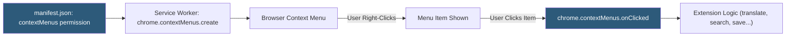

**Category:** Browser Extension & Plugin Platforms
**Difficulty:** Beginner
**Reading time:** 5 min read

---

The Chrome Extension Context Menus API allows extensions to add custom items to the browser's right-click context menu, enabling users to trigger extension actions on selected text, images, links, or page elements without navigating to the extension popup. Context menus are a powerful UX pattern for integrating extension functionality into natural browsing workflows.

- **chrome.contextMenus.create** — API call that registers a new context menu item with title, contexts, and click handler
- **Context type** — The element type the menu item appears for: `page`, `selection`, `link`, `image`, `video`, `audio`, `editable`, `browser_action`
- **Parent item** — A top-level context menu entry that groups child items into a submenu
- **onClick handler** — Callback registered in the service worker that fires when the menu item is clicked
- **info.selectionText** — Property on the click info object containing the text selected when the menu was triggered
- **Separator** — A horizontal dividing line created with `type: "separator"` to visually group menu items
- **Checkbox/radio items** — Context menu items with toggle or exclusive-selection behavior
- **contextMenus permission** — Required manifest permission to use the context menus API

Context menu items must be created in the extension's service worker, typically in the `chrome.runtime.onInstalled` listener to ensure they are registered once. The `chrome.contextMenus.create()` call takes an object specifying `id` (unique string), `title` (display text), `contexts` (array of applicable context types), and optionally `parentId` for nested items.

The `contexts` array controls when the item appears. Using `["selection"]` shows the item only when text is selected; `["link"]` shows it for right-clicked links; `["image"]` for images; and `["all"]` for any context. Multiple contexts can be combined.

Dynamic menu text is possible using `%s` in the title string, which Chrome replaces with the selected text (up to 40 characters) when `contexts` includes `"selection"`. This enables natural menu items like "Search Google for '%s'".

Click handlers register via `chrome.contextMenus.onClicked.addListener(callback)`. The callback receives an `info` object with `menuItemId`, `selectionText`, `srcUrl` (for media), `linkUrl`, and `pageUrl`, plus a `tab` object with tab details.

Menu items can be updated with `chrome.contextMenus.update()` and removed with `chrome.contextMenus.remove()`. All items can be cleared with `chrome.contextMenus.removeAll()`.

Since Manifest V3 service workers are ephemeral, menu items must be re-registered on `chrome.runtime.onInstalled` and potentially persisted via `chrome.storage` if dynamic items are updated at runtime.

- Adding "Save to reading list" option when right-clicking links
- Translating selected text by right-clicking and choosing the extension's translate action
- Looking up definitions of selected words in a dictionary extension
- Adding images to a collection by right-clicking on them
- Performing custom search operations on selected text

| Advantage | Disadvantage |
|-----------|--------------|
| Integrates into user's natural right-click workflow | Context menu can become cluttered if multiple extensions add items |
| Contextual targeting means the item is relevant when shown | Limited styling; appearance matches OS/browser native menu |
| No need for users to navigate to popup for quick actions | Dynamic context menus require persistence strategy in MV3 |
| Works from any page without the extension popup being open | Cannot add items to the browser's address bar context menu |

- [Extension Browser Actions](extension-browser-actions.md)
- [Extension Popup UI](extension-popup-ui.md)
- [Background Scripts Architecture](background-scripts-architecture.md)

---
*Part of the [Browser Extension & Plugin Platforms](index.md) category · [Back to Master Index](../../index.md)*
