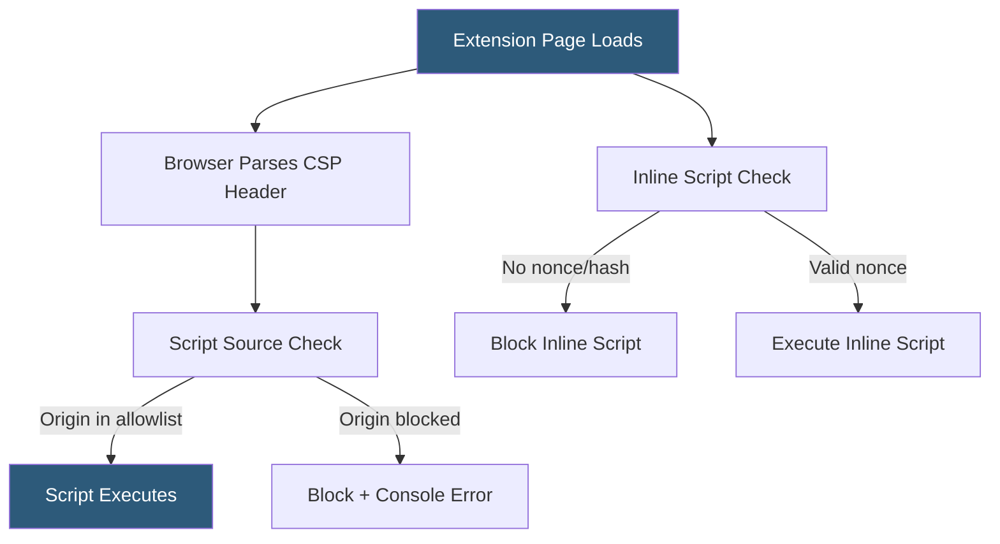

**Category:** Browser Extension & Plugin Platforms
**Difficulty:** Advanced
**Reading time:** 7 min read

---

Content Security Policy for browser extensions restricts the sources from which extension pages can load scripts, styles, and other resources, and prevents execution of inline scripts and eval(). Manifest V3 significantly tightened CSP requirements, making it impossible to load remote scripts, which forces all logic into the extension package itself.

- **CSP directive** — A policy rule specifying allowed resource origins (e.g., `script-src 'self'`)
- **`'self'` origin** — Allows resources loaded only from within the extension package
- **Manifest V3 default CSP** — `script-src 'self'; object-src 'self'` with no ability to relax script-src
- **Remote code prohibition** — MV3 rule preventing execution of any JavaScript fetched from external URLs
- **Sandbox page** — An extension page with a relaxed CSP that can run eval(), isolated from extension APIs
- **`unsafe-eval`** — CSP keyword that permits eval() and related functions; banned in MV3 extension pages
- **Nonce** — A one-time token used to allow a specific inline script without opening broad inline script permission
- **Trusted Types** — A browser API to prevent DOM-based XSS by enforcing type-safe DOM manipulation

In Manifest V2, extension developers could define a custom CSP in the manifest's `content_security_policy` field, relaxing restrictions to allow `unsafe-eval` for template engines or loading from CDNs. Manifest V3 eliminates this flexibility for extension pages — the default CSP of `script-src 'self'; object-src 'self'` is enforced with no mechanism to allow external scripts or eval.

For extension service workers (background), the restriction is even stricter: no CSP customization is possible. Any library or framework used by the extension must be bundled into the extension package at build time using a bundler like webpack, Rollup, or esbuild.

Sandbox pages provide an escape hatch for legacy code or features requiring eval. A sandboxed page is declared in the manifest under `sandbox.pages` and communicates with the rest of the extension via `postMessage`. The sandbox has its own relaxed CSP and no access to `chrome.*` extension APIs, making it safe to run isolated evaluation.

Content scripts run in the context of web pages rather than extension pages and are subject to the host page's CSP, not the extension's CSP. This means content scripts injected into pages with strict CSPs must avoid dynamic script creation.

Developers should audit their CSP compliance using the Chrome Extensions Content Security Policy validator and check the browser console for CSP violation reports during development.

- Preventing XSS attacks in extension popup and options pages
- Blocking exfiltration of sensitive data via unauthorized external requests
- Satisfying Chrome Web Store's Manifest V3 compliance requirements
- Isolating risky evaluation logic in sandbox pages
- Enforcing that only bundled, audited code executes within the extension

| Advantage | Disadvantage |
|-----------|--------------|
| Strong protection against script injection attacks | Remote code prohibition requires bundling all dependencies |
| Forces auditable, deterministic extension behavior | Migrating MV2 extensions with eval() to MV3 requires significant refactoring |
| Reduces attack surface for supply chain compromise | Sandbox pages add complexity for features requiring dynamic evaluation |
| Aligns with web platform security best practices | Strict CSP can break third-party integrations using dynamic script loading |

- [Chrome Extension Manifest V3](chrome-extension-manifest-v3.md)
- [Extension Permissions Model](extension-permissions-model.md)
- [Extension Privacy Policies](extension-privacy-policies.md)

---
*Part of the [Browser Extension & Plugin Platforms](index.md) category · [Back to Master Index](../../index.md)*
