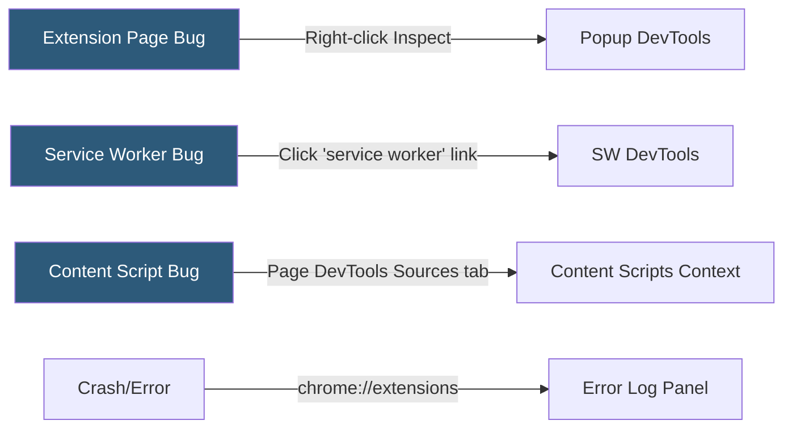

**Category:** Browser Extension & Plugin Platforms
**Difficulty:** Intermediate
**Reading time:** 6 min read

---

Debugging browser extensions requires different tooling than standard web development because extensions run across multiple contexts — service workers, content scripts, popup pages, and options pages — each with its own DevTools entry point. Mastering extension-specific debugging workflows dramatically reduces the time to diagnose runtime errors, message passing failures, and permission issues.

- **Extension DevTools** — The `chrome://extensions` developer mode panel for loading, reloading, and inspecting extensions
- **Service worker inspector** — DevTools panel for debugging the Manifest V3 background service worker
- **Content script context** — The isolated JavaScript world where content scripts run within page processes
- **Extension page DevTools** — Standard DevTools opened against popup.html, options.html, or other extension pages
- **Error reporting** — The extension management page's built-in error log showing uncaught exceptions
- **chrome.runtime.lastError** — API property that must be checked in callbacks to detect async errors
- **Message inspector** — No built-in tool; developers use console.log interception in message listeners
- **Extension Reloader** — Third-party extension that watches source files and auto-reloads the extension during development

Each extension context has a distinct DevTools entry point. For popup pages and options pages, right-clicking the extension UI and selecting "Inspect" opens standard DevTools scoped to that page. For the Manifest V3 service worker, navigate to `chrome://extensions`, find the extension, and click the "service worker" hyperlink to open a dedicated DevTools session.

Content scripts are visible in the page's DevTools under the Sources tab in a "Content scripts" folder. Breakpoints set there work the same as page breakpoints. Note that content scripts run in an isolated world by default, so they cannot access page JavaScript variables directly.

The `chrome://extensions` management page shows a "Errors" button (when errors exist) that lists uncaught exceptions with stack traces across all extension contexts. This is the fastest place to check when an extension stops working without obvious cause.

For message passing bugs, add `console.log` statements in both `chrome.runtime.sendMessage` callers and `chrome.runtime.onMessage` listeners. The chrome.runtime.lastError property surfaces errors in callbacks; always check it: `if (chrome.runtime.lastError) { console.error(chrome.runtime.lastError.message); }`.

Tools like the "Extensions Reloader" extension or webpack watch mode with automatic CRX reloading streamline the edit-reload-test cycle. Chrome also supports source maps in extensions, so bundled code can be debugged against original source files.

- Diagnosing why a background service worker is being terminated unexpectedly
- Tracing message passing failures between content scripts and the service worker
- Inspecting extension storage contents using the Application tab
- Debugging permission-related errors causing API calls to fail silently
- Profiling popup render performance for complex extension UIs

| Advantage | Disadvantage |
|-----------|--------------|
| Browser DevTools provide full debugging capability for each context | Multiple DevTools windows required to debug cross-context issues simultaneously |
| Error log in chrome://extensions surfaces background errors without DevTools | No built-in message inspector makes tracing postMessage flows tedious |
| Source maps enable debugging minified production builds | Service worker DevTools close when the worker terminates, losing debug state |
| Standard web debugging skills transfer to extension contexts | Content script isolated world prevents inspecting page variables directly |

- [Extension Devtools Integration](extension-devtools-integration.md)
- [Background Scripts Architecture](background-scripts-architecture.md)
- [Chrome Extension Service Workers](chrome-extension-service-workers.md)

---
*Part of the [Browser Extension & Plugin Platforms](index.md) category · [Back to Master Index](../../index.md)*
