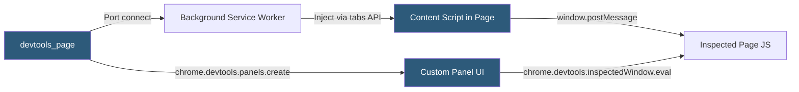

**Category:** Browser Extension & Plugin Platforms
**Difficulty:** Advanced
**Reading time:** 7 min read

---

Extensions can add custom panels and sidebars to the browser's built-in DevTools, enabling developer tools that inspect application-specific state (React component trees, Redux store, network patterns) alongside standard debugging tools. Building a DevTools extension requires understanding the unique three-context communication architecture required for DevTools pages.

- **devtools_page** — A background HTML page declared in the manifest that loads when DevTools opens and has access to `chrome.devtools.*` APIs
- **DevTools panel** — A custom tab added to the DevTools window via `chrome.devtools.panels.create()`
- **DevTools sidebar** — A sidebar pane attached to the Elements or Sources panel via `chrome.devtools.panels.elements.createSidebarPane()`
- **Inspected window** — The web page currently open in the tab being inspected by DevTools
- **chrome.devtools.network** — API for intercepting and analyzing network requests from the inspected page
- **Evaluated script** — Code run in the context of the inspected page via `chrome.devtools.inspectedWindow.eval()`
- **Port messaging** — Long-lived connection used to relay messages between devtools_page and background service worker
- **Content script bridge** — Pattern using injected content script to expose page JavaScript state to the extension

When DevTools is opened for a tab, Chrome creates the `devtools_page` specified in the manifest. This page runs in a separate extension process with access to the `chrome.devtools.*` APIs but not to the DOM of the inspected page. To communicate with the inspected page, the devtools_page must relay through the background service worker, which can inject content scripts.

The `chrome.devtools.panels.create()` call registers a new panel tab in DevTools, specifying its title, icon, and HTML page to render. The panel page is a standard HTML/JS page that can use all regular web APIs plus DevTools-specific APIs through the `chrome.devtools` namespace.

To read JavaScript state from the inspected page, use `chrome.devtools.inspectedWindow.eval(expressionString, callback)`. This executes synchronously in the inspected page's main world and returns serializable values. For more complex data extraction, inject a content script that exposes data via custom DOM events or window.postMessage, then listen from the devtools panel through the background service worker relay.

Real-world DevTools extensions like React Developer Tools and Redux DevTools use this pattern: a content script hooks into framework internals, serializes state, and sends it via postMessage to the devtools panel, which renders the component tree or store state in real time.

The `chrome.devtools.network.onRequestFinished` API provides access to HAR-format network request data for requests made by the inspected page.

- Building framework-specific debugging panels (React, Vue, Angular component inspectors)
- Creating state management debuggers (Redux, MobX, Vuex time-travel debugging)
- Adding custom performance profiling panels for application-specific metrics
- Inspecting application-level protocols (GraphQL query inspector, WebSocket message viewer)
- Integrating backend trace IDs into DevTools network panel for distributed tracing

| Advantage | Disadvantage |
|-----------|--------------|
| Deep integration with browser debugging workflow | Complex three-context architecture requires careful message routing |
| Access to raw network HAR data for detailed request analysis | DevTools extensions are only active when DevTools is open |
| Can hook into framework internals for rich debugging experiences | eval() in inspected window is synchronous and can block the page |
| Panel UI is a full web page with no special UI constraints | Content script injection required for access to page JS variables |

- [Extension Debugging Tools](extension-debugging-tools.md)
- [Extension Messaging API](extension-messaging-api.md)
- [Background Scripts Architecture](background-scripts-architecture.md)

---
*Part of the [Browser Extension & Plugin Platforms](index.md) category · [Back to Master Index](../../index.md)*
