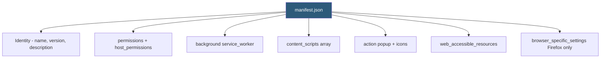

**Category:** Browser Extension & Plugin Platforms
**Difficulty:** Beginner
**Reading time:** 5 min read

---

The `manifest.json` file is the required configuration entry point for every browser extension, declaring its identity, permissions, resources, content scripts, background worker, icons, and extension pages. The manifest version (V2 or V3) determines which APIs and features the extension can use.

- **manifest_version** — Integer (2 or 3) declaring which extension platform version governs the extension's capabilities
- **permissions** — Array of API permission strings (e.g., `"tabs"`, `"storage"`, `"alarms"`) the extension declares at install time
- **host_permissions** — MV3 field for URL match patterns controlling which websites the extension can access (separated from API permissions in MV3)
- **content_scripts** — Array of objects defining which JS/CSS files to inject, into which URL patterns, and at which document lifecycle event
- **background** — Object pointing to the service worker file (MV3: `"service_worker": "background.js"`) or background page scripts (MV2)
- **action** — MV3 object defining toolbar icon, default popup HTML, and tooltip text (replaced `browser_action` from MV2)
- **web_accessible_resources** — Array of extension files that content scripts or web pages are allowed to reference via `chrome-extension://` URLs
- **browser_specific_settings** — Firefox-only field containing `gecko.id` for the Firefox extension ID and minimum version constraints

When Chrome or Firefox loads an extension, the first file parsed is `manifest.json`. The browser validates the manifest version, checks that all declared permissions are valid and recognized API strings, resolves file paths for content scripts and the service worker, and registers the extension in the browser's extension registry.

The `permissions` array in MV3 contains only API identifiers (`"tabs"`, `"bookmarks"`, `"notifications"`). The `host_permissions` array separately contains URL patterns. This separation was introduced in MV3 to make the permission grant dialog clearer to users — they see "Read and change data on example.com" as a distinct grant from "Read browser history."

`content_scripts` entries specify `matches` (URL patterns), `js` (script files), `css` (stylesheet files), and `run_at` (`"document_start"`, `"document_end"`, `"document_idle"`). The browser injects these scripts into every matching page at the specified document lifecycle event. The `all_frames` boolean controls whether scripts inject into iframes as well as the top frame.

`web_accessible_resources` in MV3 is an array of objects with `resources`, `matches`, and optional `use_dynamic_url`. This controls which extension-bundled files (images, fonts, iframes) can be referenced from the web page context. Without this declaration, the `chrome-extension://` URL for those files is blocked by CORS.

`browser_specific_settings.gecko.id` in Firefox determines the internal extension ID used for storage namespacing and update delivery. If omitted, AMO assigns a random ID that cannot be specified later, breaking update delivery to existing users.

- Declaring minimal permissions to pass Chrome's review minimum-permission policy requirements
- Specifying `"run_at": "document_start"` in content_scripts to inject before the page's own scripts execute (for ad blockers)
- Using `web_accessible_resources` with `matches` restrictions to allow only specific domains to embed extension UI in iframes
- Setting `"action": {"default_popup": "popup.html"}` to create an extension toolbar button that opens an HTML popup
- Maintaining a shared manifest template and using a build script to inject `browser_specific_settings` for Firefox builds only

| Advantage | Disadvantage |
|-----------|--------------|
| Single JSON file provides complete extension configuration at a glance | Manifest version migration (MV2 → MV3) requires significant code changes |
| Declarative nature makes permissions auditable before install | Verbose host_permissions patterns for broad access increase user concern |
| Browser validates manifest schema and catches errors on load | Schema errors cause silent extension load failures that can be hard to debug |
| browser_specific_settings enables Firefox-specific configuration in one file | Cross-browser manifest differences require build tooling for clean separation |

- [Chrome Extension Manifest V3](chrome-extension-manifest-v3.md)
- [Extension Permissions Model](extension-permissions-model.md)
- [WebExtensions API Standard](webextensions-api-standard.md)
- [Content Scripts Injection](content-scripts-injection.md)

---
*Part of the [Browser Extension & Plugin Platforms](index.md) category · [Back to Master Index](../../index.md)*
