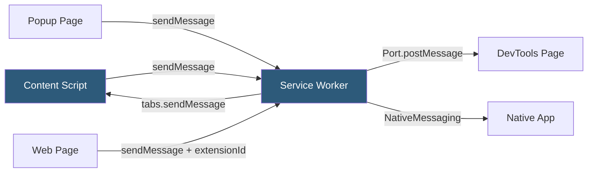

**Category:** Browser Extension & Plugin Platforms
**Difficulty:** Intermediate
**Reading time:** 6 min read

---

The Chrome Extension Messaging API enables communication between the isolated contexts of an extension — service workers, content scripts, popup pages, and options pages. Two patterns exist: one-time messages for simple request-response and long-lived port connections for streaming communication. Understanding the messaging model is essential for coordinating complex cross-context logic.

- **chrome.runtime.sendMessage** — Sends a one-time message from any context to the extension's service worker or other extension pages
- **chrome.tabs.sendMessage** — Sends a one-time message from the service worker to a specific tab's content script
- **chrome.runtime.onMessage** — Event listener that receives messages and optionally sends a response
- **Port** — A long-lived bidirectional communication channel opened via `chrome.runtime.connect()`
- **External messaging** — Communication from web pages to extensions via `chrome.runtime.sendMessage(extensionId, ...)`
- **Native messaging** — Protocol allowing extensions to communicate with native desktop applications
- **Message serialization** — Automatic JSON serialization of message objects; functions and DOM nodes cannot be passed
- **Async response** — Returning `true` from onMessage listener signals that the response will be sent asynchronously

The messaging API uses asynchronous event-based communication because extension contexts run in separate processes and cannot share memory. `chrome.runtime.sendMessage(message, callback)` sends a JSON-serializable message to the extension's service worker or to any other extension page listening on `chrome.runtime.onMessage`. The listener receives `(message, sender, sendResponse)` and can call `sendResponse(data)` synchronously or asynchronously.

For asynchronous responses, the listener must return `true` to keep the message channel open after the handler function returns. Failing to do this causes the port to close before `sendResponse` is called, resulting in a "message channel closed before a response was received" error.

Content scripts cannot use `chrome.runtime.sendMessage` to communicate directly with other content scripts or with popup pages — all messages must route through the service worker. The service worker then uses `chrome.tabs.sendMessage(tabId, message)` to forward to content scripts in specific tabs.

Long-lived connections via `chrome.runtime.connect()` create a Port object with `postMessage` and `onMessage` properties. These are appropriate for streaming data (like DevTools communication or real-time state updates) where multiple messages will flow over an open connection.

External messaging allows web pages to send messages to extensions by calling `chrome.runtime.sendMessage(extensionId, message)`, provided the extension declares `"externally_connectable"` in its manifest with the allowed origins.

- Relaying user actions from content scripts to the service worker for processing
- Streaming real-time data from a service worker to the DevTools panel
- Triggering content script actions from the extension popup
- Receiving commands from a web app to control extension behavior
- Bridging extension logic with native desktop applications via native messaging

| Advantage | Disadvantage |
|-----------|--------------|
| Isolates contexts for security and stability | All communication is asynchronous, requiring careful error handling |
| JSON serialization ensures safe data passing | Functions, DOM nodes, and circular objects cannot be passed as messages |
| Ports enable efficient streaming without repeated handshakes | Content scripts cannot message each other directly |
| External messaging enables web app to extension integration | Async response pattern is easy to get wrong, causing silent failures |

- [Background Scripts Architecture](background-scripts-architecture.md)
- [Content Scripts Injection](content-scripts-injection.md)
- [Extension Devtools Integration](extension-devtools-integration.md)

---
*Part of the [Browser Extension & Plugin Platforms](index.md) category · [Back to Master Index](../../index.md)*
