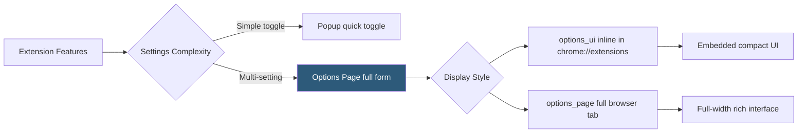

**Category:** Browser Extension & Plugin Platforms
**Difficulty:** Beginner
**Reading time:** 5 min read

---

An extension options page is a persistent HTML page where users configure extension settings, providing a dedicated space for preferences that don't fit in a popup. Unlike a popup, the options page persists in a full browser tab or sidebar panel and is accessible via the extension management page at `chrome://extensions`.

- **options_page** — Manifest field pointing to a full-tab options HTML file: `"options_page": "options.html"` (original style)
- **options_ui** — Manifest field for the newer embedded options style, rendering the page inline in Chrome's extension settings panel
- **open_in_tab** — Boolean in `options_ui` controlling whether the page opens in a new tab (`true`) or inline within chrome://extensions (`false`)
- **chrome.storage.sync** — Standard persistence layer for settings; syncs preferences across the user's devices when logged into Chrome
- **chrome.runtime.openOptionsPage()** — API call from popup or content script to programmatically open the options page
- **Persistent Context** — Options pages are not destroyed on blur like popups; they persist in a tab until explicitly closed
- **chrome.storage.onChanged** — Event for listening to settings changes from any extension context; options page can react to real-time changes
- **Input Validation** — Best practice to validate user input in the options page before writing to storage to prevent corrupt settings from breaking extension behavior

Two manifest fields configure options pages. `"options_page": "options.html"` opens the page in a dedicated browser tab with a full-width viewport — appropriate for complex configuration interfaces. `"options_ui": {"page": "options.html", "open_in_tab": false}` renders the page embedded inside the Chrome extensions panel as a constrained-width inline form — appropriate for simpler settings.

The options page runs in the same privileged extension context as the popup. It can read and write `chrome.storage`, communicate with the service worker, and use all Chrome APIs the extension has declared. The page is not isolated like a content script — it is a first-party extension page with full privileges.

Settings are conventionally stored in `chrome.storage.sync` so they roam across the user's devices. The options page reads from storage on load to populate form fields with current values, and writes back to storage on form submit or on input change (for instant-save patterns).

`chrome.storage.onChanged` enables reactive updates. If the options page and the popup are both open simultaneously, the popup can listen for storage changes and update its display immediately when the user saves a new setting in the options page, without polling.

`chrome.runtime.openOptionsPage()` lets any extension context (popup button, content script action, service worker) navigate the user to the options page. This is the canonical way to add a "Settings" button in the popup.

- Building a comprehensive settings form for an extension with dozens of configurable behaviors
- Providing an inline options panel accessible from `chrome://extensions` without leaving the extensions management page
- Implementing an onboarding flow on first install: `chrome.runtime.onInstalled` fires, options page opens automatically to guide user configuration
- Allowing users to manage a whitelist of domains where the extension is enabled/disabled
- Displaying usage statistics and resetting extension data via a dedicated settings and data management interface

| Advantage | Disadvantage |
|-----------|--------------|
| Persistent tab context enables complex forms without popup timeout constraints | Full-tab options page is heavier — may feel disproportionate for simple settings |
| chrome.storage.sync auto-syncs settings across devices | sync storage has a 100KB quota and per-item size limits |
| openOptionsPage() provides seamless navigation from popup to settings | Inline options_ui has width constraints that limit complex form layouts |
| Persistent page allows complex multi-step configuration workflows | Users may not discover the options page unless explicitly directed to it |

- [Extension Popup UI](extension-popup-ui.md)
- [Extension Storage API](extension-storage-api.md)
- [Extension Manifest Files](extension-manifest-files.md)
- [Chrome Extension APIs](chrome-extension-apis.md)

---
*Part of the [Browser Extension & Plugin Platforms](index.md) category · [Back to Master Index](../../index.md)*
