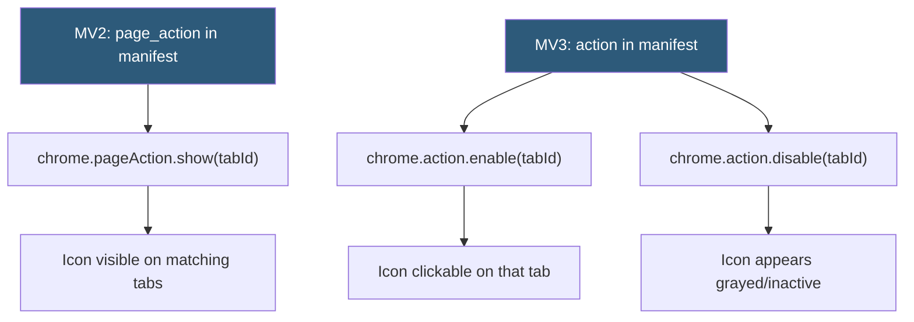

**Category:** Browser Extension & Plugin Platforms
**Difficulty:** Beginner
**Reading time:** 5 min read

---

Page actions were a Manifest V2 API that allowed extension icons to appear in the browser toolbar only on specific pages matching certain criteria, contrasting with browser actions that showed on every page. In Manifest V3, page actions and browser actions are unified under the `chrome.action` API, with `enable()`/`disable()` per-tab providing equivalent functionality.

- **page_action (MV2)** — A toolbar icon visible only on tabs where the extension was explicitly shown via `chrome.pageAction.show(tabId)`
- **chrome.action.enable/disable** — MV3 equivalent that controls whether the toolbar button is interactive for a specific tab
- **Tab-specific state** — Extension action state that varies per browser tab rather than being globally applied
- **declarativeContent API** — An alternative to programmatic page_action that shows/hides actions based on page URL or content rules
- **chrome.tabs.onUpdated** — Event used to detect page navigation and conditionally show/hide the action icon
- **Content match** — Rule-based matching on URL patterns or CSS selectors used with declarativeContent
- **Action badge** — Text overlay on the icon that can be set per-tab using the `tabId` parameter
- **Icon graying** — Visual dimming of the action icon when disabled on a tab to signal inactivity

In Manifest V2, extensions declared `page_action` in the manifest instead of `browser_action`. By default the icon was invisible on all tabs; the extension service worker called `chrome.pageAction.show(tabId)` to make it visible on specific tabs. This was commonly used for extensions like RSS readers (showing only on pages with RSS feeds) or form fillers (showing only on forms).

The pattern required listening to `chrome.tabs.onUpdated` and `chrome.tabs.onActivated` events, checking each page URL or content, and calling show/hide accordingly.

In Manifest V3, both `browser_action` and `page_action` are replaced by a single `action` key. The equivalent of page_action behavior is achieved by calling `chrome.action.disable()` for all tabs by default (at extension install time) and then `chrome.action.enable(tabId)` only for matching tabs.

The `chrome.declarativeContent` API provides a declarative alternative that avoids the need to programmatically listen to tab events. Rules are set once via `chrome.declarativeContent.onPageChanged.addRules()`, specifying URL filters and CSS selectors. The API then automatically manages action show/hide state based on these rules, reducing CPU overhead from tab event listeners.

Tab-specific badge text and icon can also be set using the optional `tabId` parameter in `chrome.action.setBadgeText({ text: "✓", tabId: tab.id })`.

- Showing a "fill form" button only on pages with login or payment forms
- Displaying an RSS subscription icon only on pages with feed links
- Activating a developer tool icon only on localhost or staging domains
- Showing a price comparison icon only on supported e-commerce sites
- Enabling a "save to app" button only on specific content domains

| Advantage | Disadvantage |
|-----------|--------------|
| Reduces toolbar icon clutter by contextualizing the action | Requires listening to multiple tab events to maintain per-tab state |
| Signals to users that the extension is relevant on this specific page | declarativeContent has limited matching options compared to programmatic checks |
| Tab-specific state keeps extension interactions meaningful | MV2 page_action migration to MV3 requires refactoring the manifest and APIs |
| declarativeContent rules run with no JavaScript overhead | Per-tab disable state can be confusing if users expect the icon always clickable |

- [Extension Browser Actions](extension-browser-actions.md)
- [Extension Popup UI](extension-popup-ui.md)
- [Chrome Extension APIs](chrome-extension-apis.md)

---
*Part of the [Browser Extension & Plugin Platforms](index.md) category · [Back to Master Index](../../index.md)*
