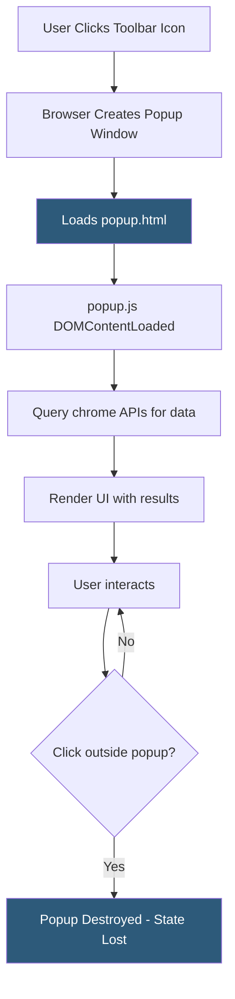

**Category:** Browser Extension & Plugin Platforms
**Difficulty:** Beginner
**Reading time:** 5 min read

---

An extension popup is the HTML page that appears when a user clicks the extension's icon in the browser toolbar. It is a standard HTML/CSS/JavaScript page running in the extension's privileged context with full access to extension APIs, but with a constrained lifecycle — it closes the moment the user clicks outside it.

- **default_popup** — The `action.default_popup` field in manifest.json specifying the HTML file to render when the toolbar icon is clicked
- **Popup Lifecycle** — The popup document opens on toolbar click and is destroyed (along with all its state) when the user clicks elsewhere or the popup is programmatically closed
- **Extension Page Context** — The popup runs in the extension's origin (`chrome-extension://`) with access to all Chrome extension APIs, unlike content scripts
- **Popup Dimensions** — Chrome constrains popup width (25px–800px) and height (up to 600px); the popup auto-sizes to its content within these limits
- **DOMContentLoaded Pattern** — Best practice: attach all event listeners inside a `DOMContentLoaded` handler to ensure the DOM is ready before JS runs
- **popup.html, popup.js, popup.css** — Conventional file names for popup HTML, JavaScript, and styles; must be listed in `web_accessible_resources` if referenced cross-context
- **chrome.action.setPopup()** — Runtime API to change which HTML file serves as the popup dynamically, enabling context-sensitive popup content
- **No Inline Scripts** — Extension CSP prohibits inline ``). All JavaScript must be in separate `.js` files loaded via `<script src="popup.js">`. This applies to all extension pages, not just popups.

`chrome.action.setPopup({popup: 'premium.html'})` can switch the popup file dynamically based on user state (e.g., logged-in users see a different popup than free users). Setting it to an empty string (`""`) disables the popup and fires `chrome.action.onClicked` instead, useful for extensions that trigger a single action without a UI.

- Displaying a quick settings toggle panel when the user clicks the toolbar icon for a privacy extension
- Showing a summary of items found on the current page (coupon codes, links, keywords) fetched on popup open
- Providing a mini dashboard for a productivity extension showing today's task count pulled from `chrome.storage`
- Rendering a login form in the popup that authenticates and stores a token via `chrome.identity`
- Using `chrome.action.setPopup()` to show different popup content for free vs premium users

| Advantage | Disadvantage |
|-----------|--------------|
| Full Chrome API access without the restrictions of content scripts | Popup is destroyed on blur — cannot run async operations longer than user focus |
| HTML/CSS/JS enables rich interactive UI without native code | Width/height constraints limit complex dashboard layouts |
| Fast to build — any web developer skill set applies | No inline scripts enforced by CSP requires careful code organization |
| setPopup() enables dynamic context-aware UI without multiple extensions | Each popup open re-runs all initialization — avoid expensive operations at startup |

- [Extension Manifest Files](extension-manifest-files.md)
- [Extension Options Page](extension-options-page.md)
- [Background Scripts Architecture](background-scripts-architecture.md)
- [Extension Messaging API](extension-messaging-api.md)

---
*Part of the [Browser Extension & Plugin Platforms](index.md) category · [Back to Master Index](../../index.md)*
