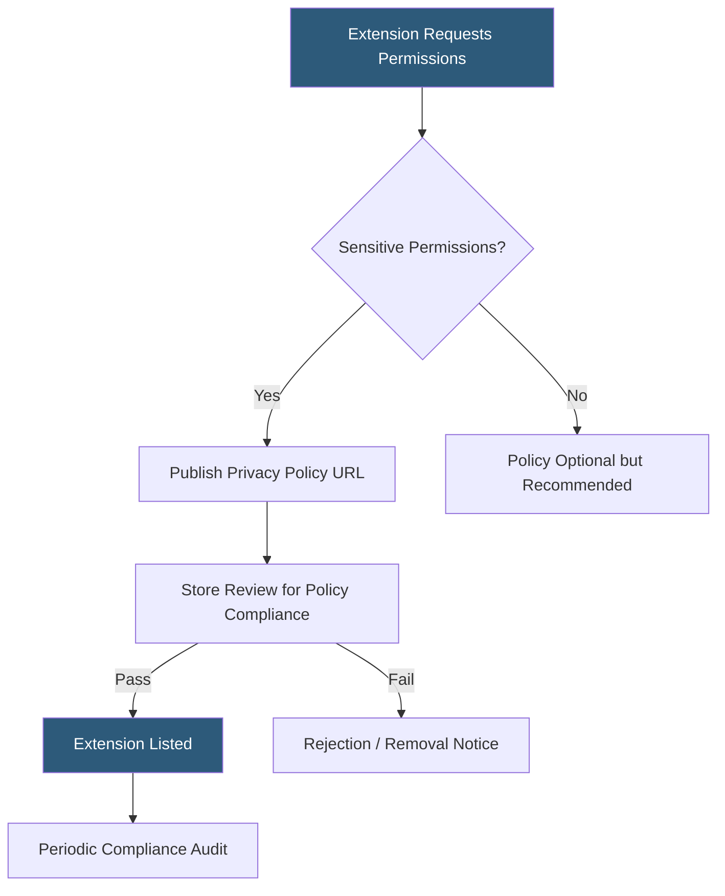

**Category:** Browser Extension & Plugin Platforms
**Difficulty:** Intermediate
**Reading time:** 6 min read

---

Browser extension stores require developers to publish privacy policies that clearly disclose what data the extension collects, how it is used, and with whom it is shared. Extensions requesting sensitive permissions (browsing history, cookie access, clipboard) face additional scrutiny, and policy violations can result in removal from stores.

- **Data disclosure** — Explicit statement of every type of user data collected by the extension
- **Limited use policy** — Chrome's requirement that data collected be used only for the extension's stated purpose
- **Sensitive permissions** — Permissions like `history`, `tabs`, `cookies`, and `webRequest` that require policy justification
- **Privacy policy URL** — A publicly accessible page required in store listings for data-collecting extensions
- **Data minimization** — Collecting only the minimum data necessary to provide functionality
- **Remote code policy** — Chrome's Manifest V3 prohibition on executing remotely hosted code
- **Single purpose policy** — Store requirement that extensions serve a single, narrow purpose
- **GDPR/CCPA compliance** — Legal requirements for handling EU and California user data

Chrome Web Store requires a privacy policy URL in the store listing for any extension that handles personal or sensitive user data. The policy must describe what data is collected, its purpose, storage duration, third-party sharing, and user rights. Chrome's Limited Use Policy goes further by requiring that data collected from user activity be used only to provide or improve the stated single purpose of the extension.

Extensions that violate privacy requirements face removal without appeal if violations are egregious (selling browsing history, injecting ads, harvesting credentials). Minor violations trigger a warning with a 30-day remediation window. The Chrome Web Store Privacy tab in the developer dashboard now requires developers to self-certify their data practices, similar to Apple's App Store nutrition labels.

For GDPR compliance, extensions targeting EU users must implement the right to erasure, provide a data processing agreement if acting as a data processor, and obtain lawful basis for processing. CCPA requires disclosure of sale of personal information and opt-out mechanisms. Most extension developers include these disclosures in a single privacy policy document hosted on their website or a dedicated privacy page.

Best practice is to request no permissions beyond what is strictly necessary, document every permission in the privacy policy, and conduct quarterly reviews to ensure policy text matches actual extension behavior after updates.

- Satisfying Chrome Web Store policy requirements for extensions with `tabs` permission
- Documenting GDPR compliance for European user base
- Justifying sensitive permission requests during store review
- Informing users about analytics and crash reporting data collection
- Establishing user trust through transparent data practices

| Advantage | Disadvantage |
|-----------|--------------|
| Clear policies build user trust and improve install rates | Writing legally sound policies requires legal expertise |
| Store compliance avoids unexpected removal | Policy updates must be reflected in both the document and store listing |
| Data minimization reduces security risk surface | Detailed policies may deter users concerned about any data collection |
| Proactive disclosure prevents regulatory investigations | Compliance requirements vary across jurisdictions |

- [Extension Permissions Model](extension-permissions-model.md)
- [Extension CSP (Content Security Policy)](extension-csp-content-security-policy.md)
- [Chrome Extension Security Policies](chrome-extension-security-policies.md)

---
*Part of the [Browser Extension & Plugin Platforms](index.md) category · [Back to Master Index](../../index.md)*
