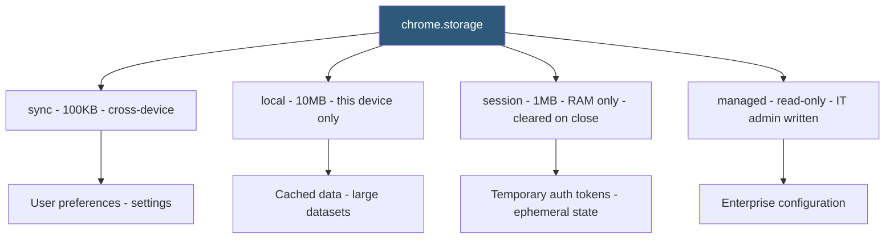

**Category:** Browser Extension & Plugin Platforms
**Difficulty:** Beginner
**Reading time:** 5 min read

---

The `chrome.storage` API provides extensions with persistent key-value storage accessible from all extension contexts (service worker, popup, options page, content scripts). It offers three namespaces — `sync`, `local`, and `session` — each with different persistence, quota, and synchronization behaviors, replacing the use of `localStorage` which is unavailable in service workers.

- **chrome.storage.sync** — Storage that syncs across the user's Chrome-signed-in devices; 100KB total quota, 8KB per item
- **chrome.storage.local** — Device-local storage; 10MB quota by default (can request `unlimitedStorage` permission); not synced
- **chrome.storage.session** — In-memory storage cleared when the browser session ends; 1MB quota; MV3-only; never persisted to disk
- **chrome.storage.managed** — Read-only storage written by IT administrators via group policy; extensions read but cannot write
- **get / set / remove / clear** — The four primary operations on any storage namespace, all returning Promises in modern Chrome
- **chrome.storage.onChanged** — Event fired in all extension contexts when any storage key changes, with `oldValue` and `newValue`
- **StorageArea** — The object type representing each namespace (`chrome.storage.local`, `chrome.storage.sync`, etc.)
- **localStorage Unavailability** — Standard `window.localStorage` is not accessible in service workers; `chrome.storage` is the required alternative

`chrome.storage` stores data as JSON-serializable key-value pairs. Values can be strings, numbers, booleans, arrays, or plain objects (no functions, symbols, or class instances). Calling `chrome.storage.sync.set({theme: 'dark', notifications: true})` serializes the object and persists it.

`chrome.storage.sync` uses Chrome's sync infrastructure (the same system that syncs bookmarks) to replicate storage entries across all the user's Chrome instances where the same extension is installed and the user is signed in. Changes propagate within seconds to minutes. The 8KB per-item limit and 100KB total limit constrain sync storage to lightweight settings, not data payloads.

`chrome.storage.local` is appropriate for large cached data — downloaded datasets, offline content, user-generated content. The default 10MB limit can be raised by declaring the `unlimitedStorage` permission, though this removes the upper bound entirely (device disk space permitting). Local storage does not sync but survives browser restarts.

`chrome.storage.session` (MV3 only) is stored entirely in memory. It is cleared when the browser closes, when the extension is updated, or when Chrome is restarted. It is fast — no disk I/O — and appropriate for ephemeral state like cached auth tokens during a browsing session. Service workers can access session storage between terminations and restarts within the same browser session.

`chrome.storage.onChanged` fires in every extension context (all open popup instances, the service worker, all content scripts with messaging set up) when data changes. The listener receives the namespace and a change object mapping keys to `{oldValue, newValue}` pairs.

- Storing user preferences (theme, language, enabled features) in `chrome.storage.sync` for cross-device consistency
- Caching API responses in `chrome.storage.local` to avoid redundant network requests on service worker restart
- Storing a session auth token in `chrome.storage.session` that expires automatically when the browser closes
- Distributing corporate policy settings to enterprise extensions via `chrome.storage.managed` written by Intune/Group Policy
- Using `chrome.storage.onChanged` to reactively update the extension popup UI when settings change in the options page

| Advantage | Disadvantage |
|-----------|--------------|
| Accessible from all extension contexts including service workers | All operations are async — synchronous localStorage patterns must be redesigned |
| sync namespace enables cross-device settings without custom backend | sync quota (100KB total / 8KB per item) limits scope of data stored |
| session namespace provides fast in-memory storage with auto-clear | session storage is lost on any browser restart or extension update |
| onChanged event enables reactive multi-context state synchronization | No querying or indexing — all data must be read and filtered in JavaScript |

- [Chrome Extension APIs](chrome-extension-apis.md)
- [Chrome Extension Service Workers](chrome-extension-service-workers.md)
- [Extension Options Page](extension-options-page.md)
- [Background Scripts Architecture](background-scripts-architecture.md)

---
*Part of the [Browser Extension & Plugin Platforms](index.md) category · [Back to Master Index](../../index.md)*
