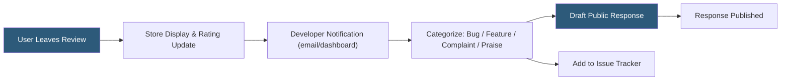

**Category:** Browser Extension & Plugin Platforms
**Difficulty:** Beginner
**Reading time:** 5 min read

---

User reviews on browser extension stores directly affect discoverability, conversion rates, and developer reputation. Effective review management involves monitoring incoming feedback, responding constructively to negative reviews, encouraging satisfied users to leave ratings, and using review content to prioritize development roadmap items.

- **Star rating** — A 1–5 aggregate score displayed prominently in store listings
- **Review response** — Developer-authored reply visible publicly beneath a user review
- **Review velocity** — The rate at which new reviews accumulate, influenced by update releases
- **Flagging** — Reporting reviews that violate store policies for removal
- **Review gates** — In-app prompts that encourage users to leave reviews at optimal moments
- **Sentiment analysis** — Automated classification of review text as positive, negative, or neutral
- **Localized reviews** — Reviews written in non-English languages requiring multilingual monitoring
- **Rating decay** — The effect of older high ratings being diluted by recent lower ratings

Chrome Web Store and Firefox AMO both allow developers to respond publicly to reviews from their developer dashboard. Responses appear beneath the original review and are visible to all potential users, making tone and content critical. A well-crafted response to a negative review can convert undecided readers into installers by demonstrating responsiveness.

Monitor reviews by configuring email notifications in the store developer console or using third-party tools that aggregate multi-store reviews (AppFollow, AppBot, ReviewFlowz). Set up keyword alerts for terms like "crash," "broken," or "privacy" to catch urgent issues immediately.

Encourage reviews ethically by prompting users at high-satisfaction moments — after a successful task completion, after a certain number of uses, or after a feature they requested ships. Avoid review gating (only prompting satisfied users) as it violates Chrome Web Store policies and can result in listing removal.

When addressing negative reviews, acknowledge the issue specifically, explain what has been fixed or what is planned, and invite the user to contact support directly. Avoid defensive language. After releasing a fix, check whether the reviewer updated their rating. Some stores allow filtering reviews by version, which helps correlate rating changes with releases.

- Identifying recurring bugs from patterns across multiple negative reviews
- Gathering feature requests directly from active users
- Demonstrating responsiveness to potential new users reading review sections
- Detecting compatibility issues after browser or OS updates
- Building a feedback loop from reviews into development sprints

| Advantage | Disadvantage |
|-----------|--------------|
| Public responses build trust with prospective users | Responding to every review is time-intensive at scale |
| Review content surfaces real-world bugs faster than bug trackers | Review removal process for policy violations is slow and uncertain |
| High ratings improve store search ranking | Competitors can manipulate ratings with fake reviews |
| Localized reviews reveal regional issues | Non-English reviews require translation for proper triage |

- [Extension Version Management](extension-version-management.md)
- [Chrome Web Store Publishing](chrome-web-store-publishing.md)
- [Extension Monetization](chrome-extension-monetization.md)

---
*Part of the [Browser Extension & Plugin Platforms](index.md) category · [Back to Master Index](../../index.md)*
