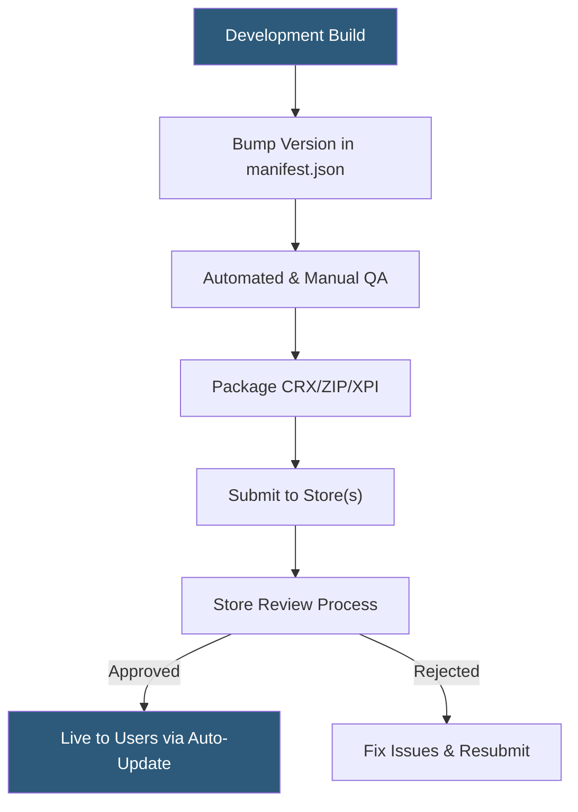

**Category:** Browser Extension & Plugin Platforms
**Difficulty:** Intermediate
**Reading time:** 6 min read

---

Extension version management covers strategies for incrementing version numbers, maintaining changelog discipline, coordinating releases across multiple browser stores, and handling rollbacks when updates cause regressions. A coherent versioning strategy reduces user disruption and simplifies debugging across the extension's lifecycle.

- **Semantic versioning** — Major.Minor.Patch scheme where breaking changes increment the major number
- **Manifest version field** — The `version` key in manifest.json that browsers use for update comparison
- **Rollback** — Reverting the store listing to a previous approved package version
- **Release channel** — Separate distribution tracks (dev, beta, stable) for different user audiences
- **Version locking** — Enterprise policy that prevents auto-updates beyond a specific version
- **Changelog** — Human-readable record of changes accompanying each version submission
- **Store review lag** — The delay between submission and approval that affects release timing
- **Version pinning** — Specifying exact dependency versions to ensure reproducible extension builds

Each browser extension manifest must declare a `version` field using a dot-separated integer string (e.g., `"1.4.2"`). Chrome supports up to four integer segments; Firefox supports standard semantic versioning with pre-release labels. The browser's update checker compares this string numerically against the current installed version to determine whether an update is available.

Good version management starts with semantic versioning conventions: increment the patch segment for bug fixes, minor for new backward-compatible features, and major for breaking changes or significant UI overhauls. Use a build script (npm version, standard-version, or custom tooling) to atomically update manifest.json, tag the git commit, and generate a changelog entry.

When releasing across multiple stores (Chrome, Firefox, Edge, Safari), stagger submissions to account for differing review timelines. Chrome Web Store reviews typically take one to three days for established developers; Firefox AMO can be faster for auto-reviewed extensions. Keep build artifacts versioned in CI to enable exact reproduction of any previously shipped package.

Enterprise administrators can enforce version locking via Group Policy (Chrome) or Intune (Edge), which means extension teams supporting enterprise customers must maintain older versions or provide migration paths. For staged rollouts on the Chrome Web Store, the developer dashboard allows percentage-based rollout of updates.

- Coordinating simultaneous releases across Chrome, Firefox, and Edge stores
- Providing enterprise customers with stable long-term support versions
- Rolling back a bad update quickly when regression reports spike
- Communicating changes clearly to users through store changelog entries
- Enforcing reproducible builds for compliance and audit requirements

| Advantage | Disadvantage |
|-----------|--------------|
| Clear versioning communicates change impact to users | Store review lags can delay critical security patches |
| Staged rollouts catch bugs before full deployment | Managing multiple store submissions adds operational overhead |
| Enterprise version locking provides stability | Maintaining legacy versions increases support burden |
| Changelogs improve user trust and transparency | Rollback capabilities vary by store and may be slow |

- [Extension Auto-Update Mechanism](extension-auto-update-mechanism.md)
- [Chrome Web Store Publishing](chrome-web-store-publishing.md)
- [Extension User Reviews Management](extension-user-reviews-management.md)

---
*Part of the [Browser Extension & Plugin Platforms](index.md) category · [Back to Master Index](../../index.md)*
