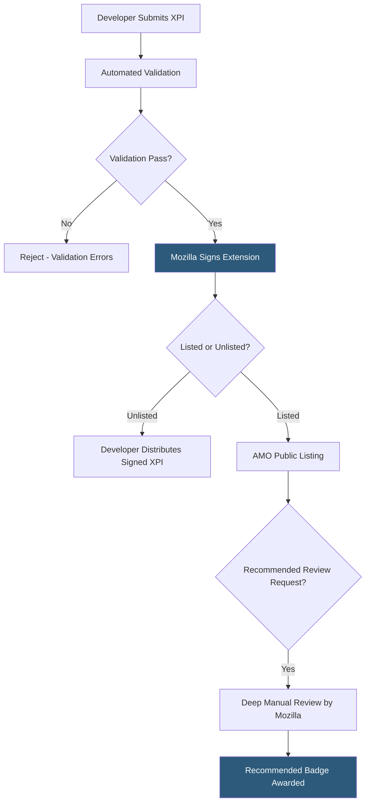

**Category:** Browser Extension & Plugin Platforms
**Difficulty:** Beginner
**Reading time:** 5 min read

---

The Firefox Add-ons Marketplace (addons.mozilla.org, or AMO) is Mozilla's official distribution platform for Firefox extensions, themes, and language packs. Unlike Chrome's store, Mozilla requires all publicly listed extensions to be signed — a process integrated into AMO submission — and enforces source code review for extensions requesting sensitive capabilities.

- **AMO (addons.mozilla.org)** — Mozilla's web portal for browsing, installing, and managing Firefox extensions
- **Extension Signing** — Mozilla's mandatory code-signing process; unsigned extensions cannot install in release Firefox builds
- **WebExtensions API** — The cross-browser extension standard that Firefox implements, largely compatible with Chrome's extension APIs
- **Recommended Extensions** — A curated subset of AMO extensions that Mozilla manually reviews more deeply and badges as trustworthy
- **Unlisted Extensions** — Extensions distributed outside AMO; they are still signed by Mozilla but not publicly indexed
- **Source Code Review** — AMO's requirement for extensions with obfuscated or minified code to submit readable source for manual review
- **Compatibility Checks** — AMO runs automated tests against multiple Firefox versions to flag API compatibility issues
- **Firefox ESR** — Extended Support Release; enterprise users on ESR may have different extension compatibility requirements

Every extension distributed to Firefox users must be signed by Mozilla, even for self-hosted distribution. Developers upload their XPI (ZIP) file to AMO's developer hub. Mozilla runs `addons-linter` — an open-source static analysis tool — checking for deprecated APIs, security issues, and policy violations. Extensions with minified JavaScript must also submit the readable source code via a separate upload field.

Once validated, Mozilla cryptographically signs the XPI by adding a signature to the manifest's `META-INF` directory. Firefox verifies this signature at install time; installation of unsigned XPIs is blocked in release and beta channels. Only Firefox Nightly and Developer Edition can install unsigned extensions (via a flag), targeting developers testing pre-AMO submissions.

Listed extensions appear publicly on AMO and receive install statistics, user reviews, and the ability to request Recommended status. Mozilla's Recommended Extensions program involves thorough manual review of functionality, privacy, and security; extensions that pass receive a badge boosting visibility and trust. Unlike Chrome's mandatory human review for all extensions, Firefox's standard path uses automated checks for public listing with human review reserved for Recommended candidates.

Unlisted extensions are signed but not indexed on AMO. Developers receive a signed XPI file they can distribute via their own website or enterprise deployment tools. This path is common for enterprise-internal tools.

- Publishing productivity extensions to AMO's 200+ million Firefox users without any mandatory human review delay
- Self-hosting signed XPI files for corporate extension distribution without public visibility on AMO
- Applying for Recommended status to increase organic discoverability for consumer-facing extensions
- Testing pre-submission builds using Firefox Developer Edition with signature enforcement disabled
- Reaching privacy-conscious users who specifically choose Firefox for its privacy defaults

| Advantage | Disadvantage |
|-----------|--------------|
| Open-source `addons-linter` tool lets developers pre-validate locally | Mandatory signing means any distribution path requires AMO involvement |
| Unlisted path enables fast corporate distribution without public review | Source code submission requirement exposes proprietary code to Mozilla reviewers |
| Recommended badge significantly boosts user trust and installs | Recommended review process is slow and selective — no SLA |
| WebExtensions compatibility enables Chrome extension code reuse | Firefox market share (~3%) is much smaller than Chrome's |

- [Firefox WebExtensions API](firefox-webextensions-api.md)
- [Firefox Add-on Signing](firefox-add-on-signing.md)
- [WebExtensions API Standard](webextensions-api-standard.md)
- [Cross-Browser Extension Development](cross-browser-extension-development.md)

---
*Part of the [Browser Extension & Plugin Platforms](index.md) category · [Back to Master Index](../../index.md)*
