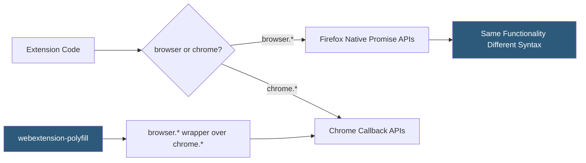

**Category:** Browser Extension & Plugin Platforms
**Difficulty:** Intermediate
**Reading time:** 6 min read

---

Firefox implements the WebExtensions API standard — the same cross-browser extension model used by Chrome, Edge, and Safari — but with Firefox-specific additions and some intentional divergences. Most Chrome extensions require only minor changes to work in Firefox, primarily around namespace differences and a few Firefox-only capabilities like container tabs.

- **browser namespace** — Firefox uses `browser.*` as the primary namespace (with Promise returns), while Chrome uses `chrome.*`; a polyfill exists to bridge them
- **Promises vs Callbacks** — Firefox's `browser.*` APIs return Promises natively; Chrome's `chrome.*` APIs historically used callbacks (now also supporting Promises in MV3)
- **webExtension-polyfill** — Mozilla's official polyfill library that wraps Chrome's `chrome.*` callback APIs in Promise-returning `browser.*` wrappers for cross-browser code
- **Contextual Identity API** — Firefox-exclusive API for managing container tabs, allowing extensions to create and assign tabs to isolated cookie contexts
- **userScripts API** — Firefox API for managing user scripts with more flexibility than Chrome's scripting API, relevant for userscript manager extensions
- **Manifest Differences** — Firefox supports some manifest keys Chrome does not (e.g., `browser_specific_settings`) and may ignore others
- **Firefox-Specific Permissions** — Permissions like `contextualIdentities` (containers) exist only in Firefox's implementation
- **StrictMinVersion** — The `browser_specific_settings.gecko.strict_min_version` field controlling minimum Firefox version compatibility

Firefox and Chrome both implement the WebExtensions specification, but they diverged during the evolution of the standard. Firefox adopted the `browser` namespace with Promise-based returns first; Chrome used `chrome` with callbacks and later added Promise support in Manifest V3.

To write code that works in both browsers without branching, developers use Mozilla's `webextension-polyfill` library, which wraps Chrome's callback-based `chrome.*` APIs to return Promises under the `browser.*` namespace. This lets developers write `await browser.tabs.query({active: true})` in code that runs on both browsers.

Firefox's container tabs feature is implemented via the `contextualIdentities` API and requires the `contextualIdentities` permission. Each container has an associated cookie store ID; assigning tabs to containers isolates their cookies, storage, and cache. This API has no Chrome equivalent — Chrome's concept of profiles is not accessible to extensions.

The `browser_specific_settings` manifest key (also called `applications` in older manifests) is Firefox-only and specifies the Gecko (Firefox engine) extension ID and minimum/maximum version. The extension ID in Firefox is separate from the Chrome extension ID, and AMO uses it for update tracking. Without this key, AMO generates a random ID, making it impossible to update the extension in users' browsers predictably.

Some Chrome MV3 features have Firefox equivalents with behavioral differences: Firefox's implementation of `declarativeNetRequest` may lag behind Chrome's in rule capacity or supported conditions.

- Porting a Chrome extension to Firefox by adding `webextension-polyfill` and a `browser_specific_settings` block with minimal code changes
- Building container tab management features for Firefox using `contextualIdentities` API not available in Chrome
- Writing cross-browser compatible async code using `await browser.tabs.*` via the polyfill
- Testing Firefox-specific API behavior in Firefox Developer Edition before AMO submission
- Enterprise deployment of Firefox extensions using `managed storage` (`browser.storage.managed`) populated via group policy

| Advantage | Disadvantage |
|-----------|--------------|
| Promise-based `browser.*` API is cleaner than Chrome's callback heritage | Firefox market share means lower user reach than Chrome extensions |
| Container tabs API enables privacy use cases impossible in Chrome | Firefox-exclusive APIs create platform-specific code branches |
| webextension-polyfill makes cross-browser code straightforward | Polyfill adds ~30KB to extension bundle size |
| Open-source Firefox lets developers understand exact API behavior | Firefox API updates sometimes lag Chrome MV3 implementation |

- [Firefox Add-ons Marketplace](firefox-add-ons-marketplace.md)
- [Firefox Add-on Signing](firefox-add-on-signing.md)
- [WebExtensions API Standard](webextensions-api-standard.md)
- [Cross-Browser Extension Development](cross-browser-extension-development.md)

---
*Part of the [Browser Extension & Plugin Platforms](index.md) category · [Back to Master Index](../../index.md)*
