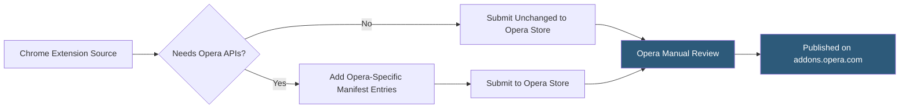

**Category:** Browser Extension & Plugin Platforms
**Difficulty:** Beginner
**Reading time:** 5 min read

---

Opera's add-ons platform at addons.opera.com distributes extensions for the Opera browser, which is Chromium-based, meaning Chrome extensions are broadly compatible. Opera maintains its own separate store and review process, and adds a handful of Opera-specific APIs for features like its built-in VPN and speed dial.

- **addons.opera.com** — Opera's official extension marketplace for browsing and installing Opera-compatible extensions
- **Chromium Compatibility** — Opera is built on Chromium, so Chrome extensions typically install and run in Opera without modification
- **Opera Extension Format** — Opera uses the standard `.crx`-equivalent package and Chrome Manifest V2/V3 format
- **Opera-Specific APIs** — Small set of APIs for Speed Dial integration (`opr.sidebarAction`), Opera's built-in VPN, and theme support
- **Developer Registration** — Opera requires a separate developer account and $9 registration fee (historical; may change)
- **Manual Review Process** — Opera reviews all extension submissions manually, with typical review times of several days
- **Speed Dial Extension** — Opera's new tab page speed dial can be extended with custom panels via Opera-specific manifest entries
- **Opera GX** — Opera's gaming-focused browser variant with its own GX store accepting Chromium-compatible extensions

Opera is built on the Chromium open-source project, inheriting Chrome's extension architecture. A developer with an existing Chrome extension can generally submit the same ZIP package to the Opera add-ons store without code changes. The Manifest V3 service worker architecture, Chrome APIs, and content scripts all work as expected.

Opera's review is manual rather than relying primarily on automation. Reviewers check the extension against Opera's content policies (no deceptive behavior, no malware, no inappropriate content) and test basic functionality. Review typically takes two to seven business days.

Opera adds a small set of platform-specific APIs. `opr.sidebarAction` enables a sidebar panel that opens in Opera's built-in sidebar — distinct from a popup. The Speed Dial integration allows an extension to add a tile to Opera's new tab speed dial page. These APIs are Opera-exclusive and gracefully degrade (or throw errors if called) in other browsers.

Opera GX, the gaming browser, maintains a separate store (store.gx.me) and extension catalog. GX store submissions are separate from the standard Opera store, allowing developers to target the gaming audience specifically. GX adds visual customization APIs for browser themes synchronized with desktop lighting systems.

Opera's market share is relatively small globally, but it has strong presence in certain regions (Africa, parts of Asia and Europe), making the store relevant for developers targeting those markets.

- Publishing an existing Chrome extension to Opera to reach additional users with minimal effort
- Building Speed Dial integrations for productivity tools that benefit from new-tab page real estate
- Targeting Opera GX's gaming audience with a dedicated GX store submission
- Testing Chromium API compatibility on a different Chromium-based browser to catch Chrome-specific assumptions
- Reaching Opera's high-adoption markets in Africa where Opera Mini/Opera are popular browsers

| Advantage | Disadvantage |
|-----------|--------------|
| Chromium base means Chrome extensions work without modification | Very small global market share compared to Chrome or Firefox |
| Manual review often provides useful feedback | Manual review takes days; no automated fast path |
| GX store opens a niche gaming audience | Developer registration fee adds friction for small developers |
| Opera-specific APIs enable unique Speed Dial/sidebar features | Opera-specific APIs create extra maintenance if targeting multiple browsers |

- [WebExtensions API Standard](webextensions-api-standard.md)
- [Cross-Browser Extension Development](cross-browser-extension-development.md)
- [Brave Browser Extensions](brave-browser-extensions.md)
- [Chrome Web Store Publishing](chrome-web-store-publishing.md)

---
*Part of the [Browser Extension & Plugin Platforms](index.md) category · [Back to Master Index](../../index.md)*
