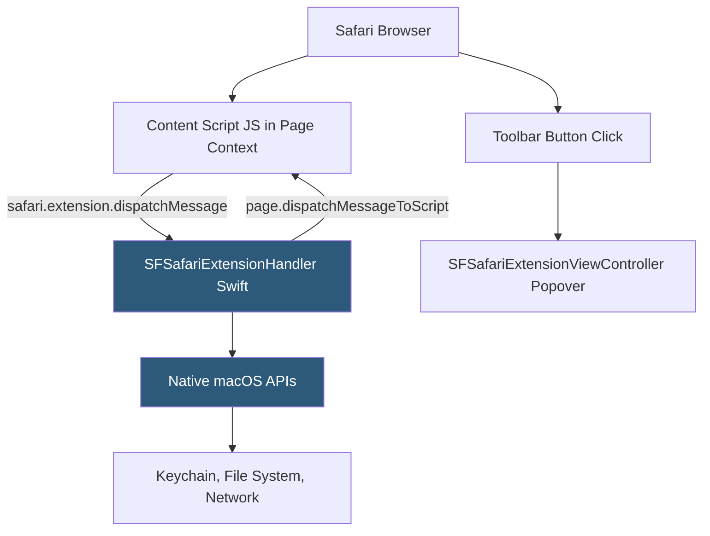

**Category:** Browser Extension & Plugin Platforms
**Difficulty:** Advanced
**Reading time:** 6 min read

---

Safari App Extensions are the older macOS-native extension model predating Safari Web Extensions, built entirely in Swift or Objective-C using AppKit APIs. They offer deeper macOS system integration than Web Extensions but require significantly more native development expertise and are increasingly superseded by Safari Web Extensions for new development.

- **NSExtension** — The macOS extension mechanism; Safari App Extensions implement the `SFSafariExtension` protocol
- **SFSafariPage** — Swift class representing a browser page, used to dispatch JavaScript to page content and receive messages
- **SFSafariExtensionHandler** — The native code entry point handling extension lifecycle events and messages from content scripts
- **Content Script (JS)** — JavaScript injected into pages, communicating back to native code via `safari.extension.dispatchMessage()`
- **Extension Toolbar Item** — A native NSButton in Safari's toolbar linked to the extension, triggering native code on click
- **SFSafariExtensionViewController** — Native view controller for the extension popover UI, rendered as native AppKit views (not HTML)
- **Native Popover** — Unlike Chrome/Firefox popups (HTML), Safari App Extension popovers are drawn with AppKit NSView hierarchy
- **macOS Keychain Access** — Available to the native extension container, enabling secure credential storage not accessible in web-based extensions

Safari App Extensions follow macOS's app extension architecture. The extension is compiled as a `.appex` bundle embedded within a containing Mac app. Safari loads the extension handler — a class conforming to `SFSafariExtensionHandler` — when the browser starts. This native class receives extension lifecycle events and handles messages from content scripts.

Content scripts are still JavaScript files injected into web pages, but communication to the native layer uses `safari.extension.dispatchMessage(name, userInfo)` instead of `chrome.runtime.sendMessage`. The native handler's `messageReceived(withName:from:userInfo:)` method is invoked in the Swift process, where it can call any macOS system API.

The extension popover is a native AppKit `NSViewController` subclass, not an HTML page. This means the UI is built with NSButton, NSTableView, and other AppKit controls, sharing the same APIs used for full Mac apps. This enables richer OS-native UI (drag-and-drop, native menus) but requires AppKit knowledge.

Because the native handler runs in the app's process, it can access the macOS Keychain via `SecItemAdd`/`SecItemCopyMatching`, write files, use CoreData, and call system frameworks — capabilities entirely unavailable to web-based extension approaches.

However, macOS App Store review and distribution requirements apply fully. Apple's notarization and code signing requirements are mandatory for any distribution.

- Building macOS password manager extensions with Keychain integration impossible in Web Extension architecture
- Extensions requiring file system access (e.g., archiving web pages to disk) via native file APIs
- Native AppKit popover UI delivering a Mac-native feel matching OS design guidelines
- System-level clipboard management extensions integrating with NSPasteboard
- VPN or network extension companions that coordinate with a system Network Extension running in the kernel

| Advantage | Disadvantage |
|-----------|--------------|
| Full macOS system API access (Keychain, File I/O, CoreData) | macOS-only — no iOS or cross-browser portability |
| Native AppKit UI integrates seamlessly with macOS design language | Requires Swift/Objective-C expertise beyond JavaScript knowledge |
| Deeply integrated with macOS security model (Keychain, sandboxing) | Increasingly deprecated in favor of Safari Web Extensions |
| No HTML rendering overhead for extension UI | Much higher development effort than HTML-based extension popups |

- [Safari Web Extensions](safari-web-extensions.md)
- [WebExtensions API Standard](webextensions-api-standard.md)
- [Extension Popup UI](extension-popup-ui.md)
- [Cross-Browser Extension Development](cross-browser-extension-development.md)

---
*Part of the [Browser Extension & Plugin Platforms](index.md) category · [Back to Master Index](../../index.md)*
