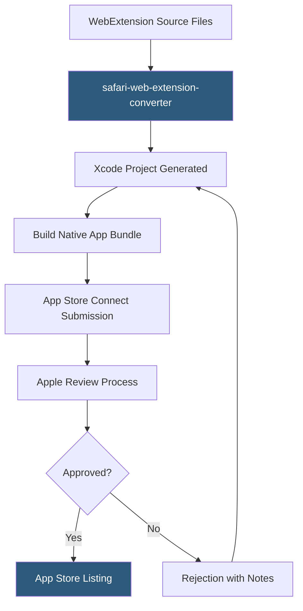

**Category:** Browser Extension & Plugin Platforms
**Difficulty:** Advanced
**Reading time:** 7 min read

---

Safari Web Extensions use the WebExtensions API standard and are distributed exclusively through the Apple App Store, packaged inside a native macOS or iOS app container. This architecture requires Xcode and an Apple Developer account, making the barrier to entry significantly higher than other browser extension platforms.

- **App Container** — Safari extensions are shipped as part of a native macOS/iOS app; the extension is an app extension embedded in the app bundle
- **Xcode Project** — Required build environment; Apple provides a converter tool (`safari-web-extension-converter`) to wrap existing WebExtension packages into Xcode projects
- **App Store Distribution** — All Safari extensions must be submitted to the App Store and pass Apple review; no sideloading for production use
- **safari-web-extension-converter** — Command-line tool that takes an existing WebExtensions ZIP and generates a ready-to-build Xcode project
- **WKWebView Message Handlers** — The communication bridge between the extension's JavaScript and the native Swift/Objective-C app container
- **iOS Extension Support** — Safari Web Extensions run on iOS 15+ as well as macOS, enabling mobile browser extensions
- **Content Blockers** — A separate (simpler) Safari extension type using JSON rule lists for ad blocking, more limited but lower overhead than full Web Extensions
- **Notarization** — Apple's malware scan applied to macOS apps including Safari extensions distributed through direct download outside App Store (rare)

Running `xcrun safari-web-extension-converter /path/to/extension` reads the extension's manifest and source files and generates a new Xcode project containing the original web extension files and a thin Swift wrapper app. The Swift app has no meaningful functionality — it exists solely as the App Store container required by Apple.

Inside Xcode, the developer sets bundle identifiers, provisioning profiles, and app metadata, then builds the project. Safari loads the extension from the native app bundle using WKWebView-based rendering for extension pages. The extension's service worker (in MV3) or background page runs within Safari's process isolation.

Communication between the JavaScript extension and native Swift code happens via `browser.runtime.sendNativeMessage`, which routes messages through a native messaging host defined in the app. This is useful for extensions that need to access macOS system APIs not exposed through WebExtensions.

The extension must be explicitly enabled by the user in Safari's Preferences > Extensions panel — no automatic activation on install. Apple's security model requires explicit user consent before an extension can run on any website.

On iOS, Safari extensions run in Safari on iPhones and iPads (iOS 15+). The same Xcode project compiles for both macOS and iOS targets, making cross-platform extension development possible but requiring handling for iOS-specific UI constraints.

Apple's review enforces the same App Store guidelines applied to any app, plus WebExtension-specific checks. Extensions with browser permission equivalents to `<all_urls>` face heightened scrutiny and must justify broad access in the review notes.

- Reaching Safari users on macOS and iOS with a single Xcode project targeting both platforms
- Building extensions with native macOS capabilities (keychain access, file system) via native messaging to the Swift container
- Shipping ad-blocking extensions as Content Blockers for simpler implementation without full WebExtension overhead
- Enterprise deployment using Mobile Device Management (MDM) to install the containing app on managed Macs
- Converting an existing Chrome/Firefox extension to Safari using the converter tool as a starting point

| Advantage | Disadvantage |
|-----------|--------------|
| Reach Safari's large user base on macOS and iOS | Requires macOS with Xcode — Linux/Windows developers need a Mac for builds |
| Native Swift container enables system API access unavailable in Chrome/Firefox | App Store submission is more complex and costly ($99/year Apple Developer Program) |
| Single Xcode project targets both macOS and iOS | App Store review applies App Store guidelines on top of extension policies |
| WKWebView native messaging bridge enables deep OS integration | Users must manually enable extensions in Safari Preferences |

- [Safari App Extensions](safari-app-extensions.md)
- [WebExtensions API Standard](webextensions-api-standard.md)
- [Cross-Browser Extension Development](cross-browser-extension-development.md)
- [Extension Permissions Model](extension-permissions-model.md)

---
*Part of the [Browser Extension & Plugin Platforms](index.md) category · [Back to Master Index](../../index.md)*
