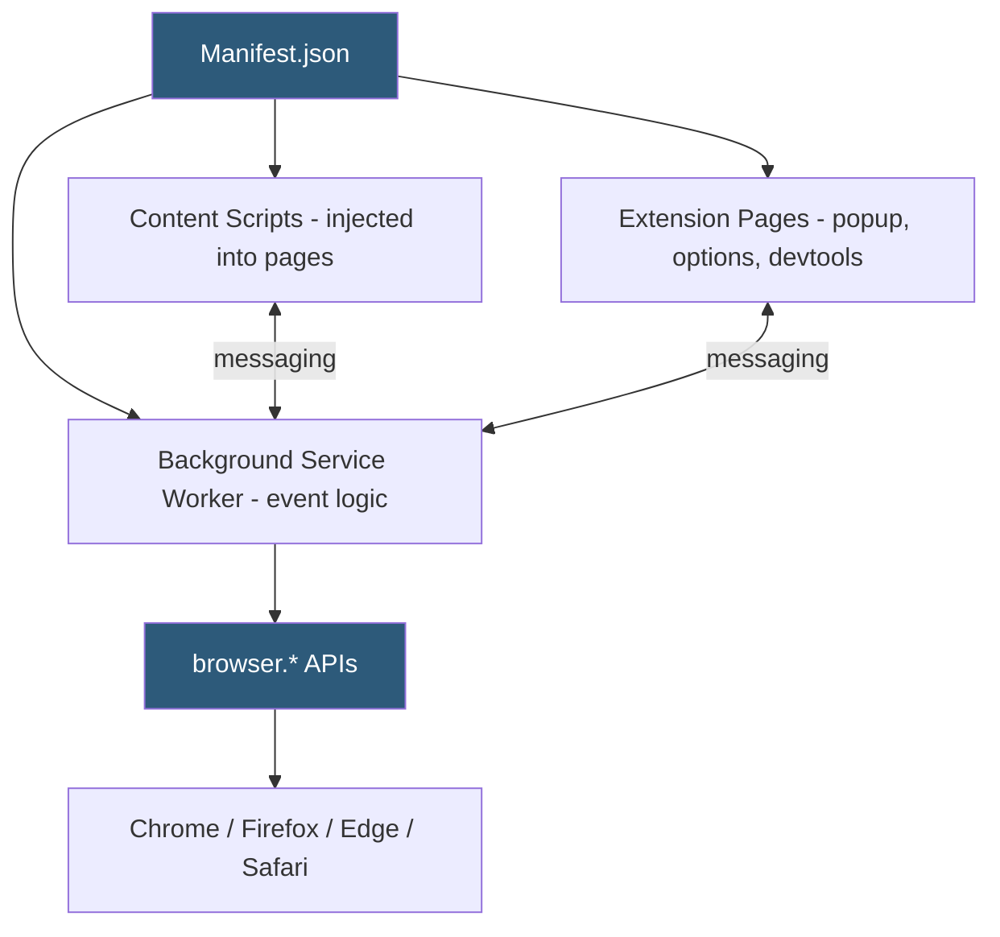

**Category:** Browser Extension & Plugin Platforms
**Difficulty:** Intermediate
**Reading time:** 6 min read

---

The WebExtensions API is a cross-browser extension standard implemented by Chrome, Firefox, Edge, Safari, Opera, and Brave that defines a common JavaScript API surface for building browser extensions. Governed loosely by the W3C WebExtensions Community Group (WECG), the standard aims to reduce the fragmentation that previously forced developers to maintain browser-specific extension codebases.

- **WECG (WebExtensions Community Group)** — W3C community group formed by Apple, Google, Mozilla, and Microsoft to converge WebExtension standards across browsers
- **browser.* namespace** — The standard namespace; Chrome uses `chrome.*` but supports `browser.*` via polyfill; Firefox uses `browser.*` natively
- **Manifest JSON** — The extension's configuration file declaring metadata, permissions, content scripts, and background service workers
- **Content Scripts** — JavaScript (and optionally CSS) injected into web pages at specified URL patterns, running in isolated worlds
- **Background Context** — Service worker (MV3) or background page (MV2) providing persistent (or event-driven) extension logic
- **Extension Pages** — HTML pages like popups, options pages, and devtools panels that run in the extension's privileged context
- **Permissions Model** — Declarative list of APIs (`tabs`, `storage`, `bookmarks`) and host patterns (`https://example.com/*`) granting access to browser capabilities
- **Cross-Browser Gaps** — Areas where browser implementations diverge despite WECG efforts, including specific API capabilities, MV3 feature parity, and manifest key support

The WebExtensions standard specifies a JSON manifest file (`manifest.json`) that every extension must provide. The manifest declares the extension's name, version, permissions, icons, content script injection rules, and background worker path. All compliant browsers parse this manifest to set up the extension's isolated process and grant declared permissions.

Content scripts are injected by the browser into matching pages according to `matches` URL patterns in the manifest or programmatically via `browser.scripting.executeScript`. Each injected content script runs in an isolated JavaScript context — sharing the DOM but not the JavaScript heap with the page or other extensions.

The background service worker (MV3) or background page (MV2) serves as the extension's coordination layer. It responds to browser events, manages state in `browser.storage`, communicates with content scripts via `browser.runtime.sendMessage`, and invokes privileged APIs.

Extension pages (popup HTML, options HTML) are full web pages running under the `chrome-extension://` or `moz-extension://` origin with access to all extension APIs. They differ from content scripts in that they are not injected into third-party pages; they are rendered in their own window or panel.

The WECG publishes specifications for common APIs, but implementations diverge. Firefox adds container tab APIs absent from Chrome; Chrome added the Offscreen Document API Firefox doesn't have; Safari requires an Xcode app bundle around the same code. These gaps mean cross-browser development still requires testing on each target and sometimes feature-detection guards.

- Building one extension codebase targeting Chrome, Firefox, and Edge using `browser.*` with webextension-polyfill
- Using the standard manifest format to declare permissions consistently across all browsers
- Referencing WECG specifications to understand which APIs are standardized vs browser-specific before building features
- Detecting browser-specific API availability with `typeof browser.contextualIdentities !== 'undefined'` guards
- Contributing to WECG discussions to advocate for standardizing APIs needed by the developer community

| Advantage | Disadvantage |
|-----------|--------------|
| Single codebase reaches all major browsers | Implementation gaps require browser-specific testing and workarounds |
| Manifest JSON format is consistent across all compliant browsers | Manifest V3 migration is inconsistently paced across browsers |
| WECG provides a forum for cross-vendor API standardization | WECG moves slowly; standards lag behind browser-specific implementations |
| webextension-polyfill bridges namespace and callback differences | Polyfill cannot bridge missing APIs — gaps require feature detection |

- [Cross-Browser Extension Development](cross-browser-extension-development.md)
- [Chrome Extension Manifest V3](chrome-extension-manifest-v3.md)
- [Firefox WebExtensions API](firefox-webextensions-api.md)
- [Extension Manifest Files](extension-manifest-files.md)

---
*Part of the [Browser Extension & Plugin Platforms](index.md) category · [Back to Master Index](../../index.md)*
