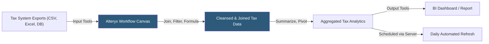

**Category:** Business Intelligence & Tax Analytics
**Difficulty:** Intermediate
**Reading time:** 6 min read

---

Alteryx is a data preparation and analytics platform that allows tax professionals to build repeatable, automated workflows for cleansing, joining, and transforming complex tax data from multiple sources. Its drag-and-drop workflow canvas replaces manual Excel data manipulation with governed, auditable processes that run in seconds rather than hours.

- **Workflow** — A directed acyclic graph of Alteryx tools connected by data streams representing a complete data transformation process
- **Tool** — An individual processing unit performing a specific operation (Join, Filter, Formula, Summarize, Union)
- **Macro** — A reusable workflow encapsulating a multi-step process, callable from other workflows
- **In-database processing** — Alteryx tool mode that pushes transformations to the database engine rather than local memory
- **Predictive tools** — R-based statistical tools integrated into Alteryx for regression and time-series tax forecasting
- **Alteryx Server** — Enterprise deployment enabling scheduled workflows, collaboration, and centralized execution
- **Gallery** — Workflow repository where analysts publish and share reusable data preparation workflows
- **XLSB/XLSX input** — Native Excel file reading supporting the multi-tab financial workbook formats common in tax

Alteryx workflows start with input tools reading from diverse tax data sources: provision system CSV exports, GL trial balance Excel files, tax return data from database tables, and web-scraped statutory rate tables. Each input tool reads its source and passes a data stream of records to downstream tools.

The core transformation for tax data preparation involves three steps: cleansing (removing duplicates with the Unique tool, standardizing jurisdiction names with Formula tool, filtering out excluded accounts with Filter tool), joining (combining actuals with budget using Join tool on entity and period keys, adding hierarchy lookups with Join or Find Replace), and reshaping (pivoting wide period columns to normalized rows with Cross Tab tool, or unpivoting using Transpose).

For book-to-tax reconciliation workflows, Alteryx joins GL trial balance data to tax return line items, calculates differences per account, and categorizes them as permanent or temporary using lookup tables. The resulting dataset feeds directly into BI dashboards or exports to Excel for review.

Macros encapsulate repeatable sub-processes — for example, a "Normalize Jurisdiction" macro that standardizes country codes, state abbreviations, and local tax authority names across all input sources. Published to the Gallery, macros are reused across multiple tax workflows without code duplication.

Scheduled server jobs automate the data preparation pipeline: the workflow runs nightly after ERP close, transforming and loading data so analysts arrive to refreshed dashboards every morning without manual intervention.

- Automating the consolidation of 50 entity trial balances into a single tax analytics dataset
- Building a book-to-tax reconciliation workflow that runs in 2 minutes vs 6 hours manually
- Standardizing jurisdiction and entity names across multiple tax system exports
- Creating a repeatable ETR calculation workflow that runs each quarter-end without manual steps
- Preparing transfer pricing data by joining intercompany transactions to entity financial summaries

| Advantage | Disadvantage |
|-----------|--------------|
| Drag-and-drop interface accessible to tax professionals without coding skills | Large datasets may exceed local memory; requires in-database or server deployment |
| Workflows are fully auditable and reproducible compared to Excel macros | Alteryx Designer and Server licensing is expensive for small teams |
| Macro reuse eliminates duplicated transformation logic across workflows | Steep learning curve for complex joins and multi-workflow orchestration |
| Scheduled server jobs eliminate manual close-period data preparation | Not a BI visualization tool; requires integration with Tableau/Power BI for dashboards |

- [Alteryx Financial Analytics](alteryx-financial-analytics.md)
- [Tableau Tax Analytics](tableau-tax-analytics.md)
- [Tax Data Warehouse Platforms](tax-data-warehouse-platforms.md)

---
*Part of the [Business Intelligence & Tax Analytics](index.md) category · [Back to Master Index](../../index.md)*
