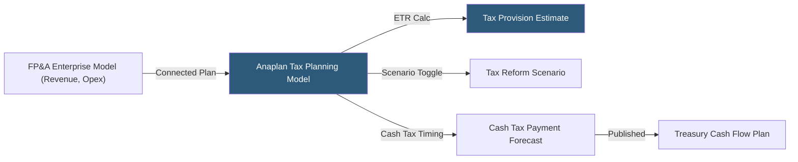

**Category:** Business Intelligence & Tax Analytics
**Difficulty:** Advanced
**Reading time:** 7 min read

---

Anaplan is a connected planning platform used by tax departments for tax cash flow forecasting, provision modeling, and scenario planning. Its Hyperblock in-memory calculation engine and multi-dimensional model architecture enable real-time what-if analysis on tax planning decisions, connecting tax models to enterprise financial plans maintained by FP&A.

- **Hyperblock** — Anaplan's patented in-memory calculation engine supporting multi-dimensional models with sparse data handling
- **Module** — A multi-dimensional data table in Anaplan combining lists (dimensions) and line items (measures)
- **List** — A dimension in Anaplan's model (entities, jurisdictions, accounts, periods)
- **Line item** — A calculated or input row in a module representing a tax measure (deferred tax, ETR, cash tax)
- **Action** — A process that imports data, runs workflows, or exports results on demand or schedule
- **Connected Planning** — Anaplan's philosophy linking tax plans to enterprise P&L forecasts and cash flow models
- **Page Builder** — Anaplan's tool for building user-facing input forms and planning dashboards
- **Version** — An Anaplan dimension tracking multiple plan versions (Actual, Budget, Forecast, Scenario)

Anaplan tax models are built as modules — multi-dimensional tables where rows are line items and columns are combinations of list members (entity × period × version). The tax planning module typically has dimensions for Legal Entity, Jurisdiction, Fiscal Period, and Version, with line items for pre-tax income (sourced from FP&A model), statutory rate, book-tax differences, deferred tax, current tax, and effective tax rate.

Connected Planning links the tax module to the enterprise FP&A model: when the FP&A team updates revenue projections, the pre-tax income in the tax module updates automatically, recalculating the tax provision and ETR without manual data export. This eliminates the time-consuming cycle of finance sending spreadsheets to tax for provision input.

Scenario modeling in Anaplan uses Versions. The Base Case version holds the current tax plan; copies (Scenario 1: Tax Reform, Scenario 2: Aggressive Position Change) hold alternative assumptions. A dashboard page shows all versions side-by-side, enabling instant comparison of ETR impact across scenarios.

Cash tax forecasting modules calculate the timing difference between accounting tax expense and actual cash tax payments, incorporating estimated tax installment rules, extension payment timing, and settlement of prior-year audit adjustments. This output feeds the treasury cash flow model.

Page Builder creates controlled input screens where tax analysts enter M adjustments, valuation allowance assessments, and UTP reserve changes, with built-in workflow and approval routing before numbers flow into the consolidated plan.

- Forecasting annual cash tax payments integrating with treasury's cash flow model
- Modeling tax provision scenarios for quarterly earnings call sensitivity analysis
- Connecting enterprise FP&A revenue plans to automated tax provision estimates
- Running tax reform legislative impact scenarios across 100+ legal entities instantly
- Collaborating across global tax centers on a unified multi-entity provision model

| Advantage | Disadvantage |
|-----------|--------------|
| Connected Planning eliminates manual handoffs between FP&A and tax teams | High implementation cost; requires Anaplan expertise or certified partner |
| Hyperblock handles multi-entity, multi-jurisdiction models at enterprise scale | Calculation syntax (Anaplan formula language) has steep learning curve |
| Version management supports unlimited tax scenarios without model duplication | Data integration requires actions and custom connectors vs direct live query |
| Workflow and approval routing enforces tax close governance | Less effective for ad-hoc analysis compared to dedicated BI visualization tools |

- [Tax Forecasting Platforms](tax-forecasting-platforms.md)
- [Tax Scenario Planning](tax-scenario-planning.md)
- [SAP Analytics Cloud](sap-analytics-cloud.md)

---
*Part of the [Business Intelligence & Tax Analytics](index.md) category · [Back to Master Index](../../index.md)*
