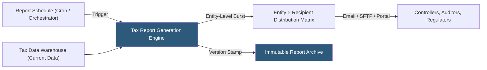

**Category:** Business Intelligence & Tax Analytics
**Difficulty:** Intermediate
**Reading time:** 6 min read

---

Automated tax reporting replaces manual extraction, formatting, and distribution of recurring tax reports with scheduled pipelines that produce governed, consistent outputs delivered to stakeholders automatically. Automation reduces close-period effort, eliminates manual errors, and ensures reporting deadlines are met regardless of staff availability.

- **Report scheduler** — A system component (cron job, workflow orchestrator, BI tool schedule) triggering report generation at specified times
- **Parameterized report** — A report template that generates different outputs for different entities or periods based on input parameters
- **Burst distribution** — Sending personalized report variants to multiple recipients from a single generation run
- **SFTP delivery** — Automated delivery of tax reports to external recipients (auditors, regulators) via secure file transfer
- **Report versioning** — Stamping each automated report with a generation timestamp and data version for auditability
- **Alert-based reporting** — Reports triggered by data conditions (ETR exceeds threshold, trial balance fails balance check)
- **Workflow integration** — Automated reports triggering downstream approvals or review workflows
- **Format output** — Reports published as PDF (formal), Excel (working paper), CSV (data feed), or HTML (web portal)

Automated tax reporting orchestration begins with a schedule configuration: which reports run on which dates, with what parameters, and to which recipients. Close-period schedules align to the accounting calendar — trial balance extract loads nightly beginning Day 1 of close; provision summary reports auto-generate on Day 3 and Day 5; final consolidated reports generate on Day 10 after review.

Report templates are pre-built with parameterized queries connecting to the tax data warehouse. A provision summary template accepts `entity_code` and `fiscal_period` as parameters, generating entity-specific reports when the scheduler runs it with each entity's parameters in a loop. This burst pattern produces 100 entity reports from one template without manual work.

Distribution matrices define who receives each report: regional tax managers receive their region's entity summaries; the CFO receives the consolidated ETR dashboard; external auditors receive workpapers via SFTP to their audit file server. Access control ensures each recipient receives only authorized data.

Report versioning stamps each output with the generation timestamp, data warehouse snapshot identifier, and parameter values, creating an immutable record of what was reported and when. This supports audit inquiries ("what did the October 10 provision report show?") without maintaining file copies manually.

Alert-based reports fire conditionally: an ETR deviation alert runs daily during close, comparing the current ETR to the prior-quarter ETR, and only distributes the report if the deviation exceeds 1 percentage point — triggering review without sending daily noise.

- Automating delivery of quarterly entity provision summaries to 60 regional controllers on close Day 5
- Scheduling automated SFTP delivery of tax workpapers to the external audit firm's secure portal
- Triggering an ETR review alert report whenever the consolidated ETR deviates more than 1% from forecast
- Publishing automated estimated tax payment reminders to the treasury team 15 days before each installment due date
- Generating annual tax compliance calendars with deadline alerts for each jurisdiction

| Advantage | Disadvantage |
|-----------|--------------|
| Automation eliminates manual effort and errors in recurring close-period reporting | Initial setup of report templates and distribution matrices requires significant configuration |
| Burst distribution from a single template ensures consistency across all entity reports | Data quality issues in the warehouse become visible at scale when automation runs without manual review |
| Versioned report archive provides audit trail without manual file management | Complex parameterized reports require testing across all entity/period combinations |
| Alert-based triggers focus attention on exceptions rather than routine reporting | Recipients may ignore automated reports without the human communication that manual distribution includes |

- [Tax Data Governance](tax-data-governance.md)
- [Tax Dashboard Visualization](tax-dashboard-visualization.md)
- [Tax KPI Tracking](tax-kpi-tracking.md)

---
*Part of the [Business Intelligence & Tax Analytics](index.md) category · [Back to Master Index](../../index.md)*
