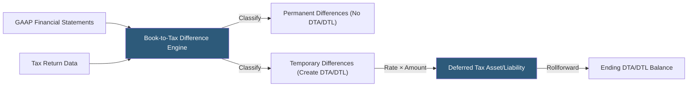

**Category:** Business Intelligence & Tax Analytics
**Difficulty:** Intermediate
**Reading time:** 6 min read

---

Book-to-tax differences represent the divergence between income and expenses recognized under GAAP financial accounting and those recognized under tax law. Understanding and systematically tracking these differences is fundamental to accurate tax provision preparation, deferred tax accounting under ASC 740, and effective tax rate analysis.

- **Book income** — Income determined under US GAAP accounting standards
- **Taxable income** — Income computed under the Internal Revenue Code after applying tax rules
- **Temporary difference** — A book-tax divergence that will reverse in future periods (depreciation, deferred revenue)
- **Permanent difference** — A book-tax divergence that never reverses (lobbying, tax-exempt income)
- **Deferred tax asset (DTA)** — Future tax benefit from a temporary difference (book deduction taken, tax deduction pending)
- **Deferred tax liability (DTL)** — Future tax cost from a temporary difference (tax deduction taken, book expense pending)
- **Gross DTA/DTL** — The pre-offset deferred tax amounts before netting per ASC 740-10-45
- **Inside vs outside basis difference** — Distinction between entity-level differences (inside basis) and investment-level differences (outside basis, relevant for consolidated subsidiaries and equity investments)

Book-to-tax difference analytics operate by comparing corresponding book and tax line items across the income statement and balance sheet. For each account or transaction category, the system computes the difference and classifies it as temporary or permanent.

The most significant temporary difference for most companies is property, plant and equipment: GAAP uses straight-line depreciation over estimated useful lives, while tax uses MACRS with accelerated rates and bonus depreciation. The cumulative tax depreciation in excess of book depreciation creates a DTL representing future taxable income when book depreciation exceeds tax depreciation in later years.

Deferred revenue creates a DTA: GAAP recognizes revenue on a performance obligation basis, while tax may require earlier inclusion (prepaid subscriptions, gift cards). The tax liability paid creates a DTA until the service is delivered and GAAP revenue catches up.

Stock-based compensation creates both temporary and permanent differences: GAAP records compensation expense at fair value at grant; tax deduction occurs at exercise (for NQSOs) or vesting (for RSUs) at the then-current spread. If the tax deduction exceeds the book expense, an excess tax benefit is recognized in equity. If the tax deduction is less, a shortfall reduces the DTA.

The rollforward schedule tracks beginning balance plus new differences generated minus reversals to arrive at the ending balance. Rate changes (federal statutory rate changes, state rate changes) are applied to the ending balance through the rate change adjustment, which flows through income and affects ETR in the period of enactment.

- Reconciling the deferred tax provision to changes in net DTA/DTL balances for audit support
- Computing the ETR effect of each significant book-tax difference category
- Modeling the DTA/DTL impact of proposed transactions (acquisitions, restructurings, lease modifications)
- Identifying new book-tax differences arising from adoption of new GAAP standards (ASC 842, ASC 606)
- Documenting book-tax differences for SOX-compliant tax provision controls

| Advantage | Disadvantage |
|-----------|--------------|
| Systematic classification prevents provision errors from missed differences | Large transaction volumes require automated classification based on GL account mapping |
| Deferred tax rollforward provides audit-ready support for ASC 740 balances | New GAAP standards (leases, revenue) create complex new temporary differences requiring specialized analysis |
| Permanent vs temporary distinction directly drives ETR calculation accuracy | Stock compensation differences require coordination with stock administration data |
| Rate change impact quantification is straightforward with tracked balances | Outside basis differences for subsidiaries require separate analysis beyond inside temporary differences |

- [Permanent vs. Temporary Differences](permanent-vs-temporary-differences.md)
- [Schedule M Adjustments](schedule-m-adjustments.md)
- [Effective Tax Rate (ETR) Analytics](effective-tax-rate-etr-analytics.md)

---
*Part of the [Business Intelligence & Tax Analytics](index.md) category · [Back to Master Index](../../index.md)*
