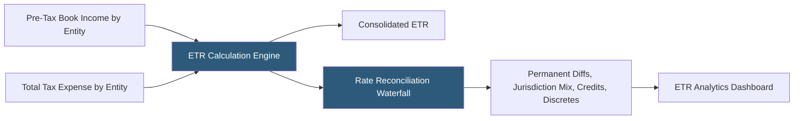

**Category:** Business Intelligence & Tax Analytics
**Difficulty:** Intermediate
**Reading time:** 6 min read

---

Effective tax rate analytics involves computing, visualizing, and explaining the ratio of income tax expense to pre-tax book income across entities, jurisdictions, and periods. ETR analytics is central to tax department reporting, investor relations, and regulatory disclosures, requiring accurate decomposition of rate drivers including permanent differences, deferred tax effects, and jurisdiction mix.

- **Consolidated ETR** — The ratio of total consolidated income tax expense to total consolidated pre-tax income
- **Permanent difference** — An item that changes taxable income but never reverses (non-deductible meals, tax-exempt interest)
- **Temporary difference** — A timing item that reverses over time, creating deferred tax assets or liabilities
- **Rate reconciliation** — The ASC 740 disclosure explaining how the statutory rate reconciles to the actual ETR
- **Mixed source income** — Combination of domestic and foreign income at different tax rates driving consolidated ETR away from statutory rate
- **Discrete item** — A one-time tax item (audit settlement, return-to-provision, valuation allowance change) outside normal ETR
- **Valuation allowance** — Reserve against deferred tax assets that creates ETR impact when established or released
- **Tax reform impact** — Rate change effect on deferred tax balances creating a one-time ETR charge or benefit

ETR analytics begins with entity-level financial data: pre-tax book income and income tax expense (current and deferred, broken down by federal, state, and foreign) for each legal entity across all periods. These inputs are sourced from the tax provision system and validated against the trial balance.

The rate reconciliation constructs the ASC 740 Table II disclosure: starting from the consolidated statutory rate (typically 21% for US companies), each rate item adjusts from the statutory rate to the actual ETR. Permanent differences at the entity level are tax-effected at the applicable statutory rate and expressed as rate percentages. Jurisdiction mix effects arise because each entity's income is taxed at different rates; the weighted average of these rates versus the parent's statutory rate creates a foreign rate differential.

ETR analytics dashboards display the current ETR alongside trend lines showing quarterly and annual ETR over prior periods. Waterfall charts break the period-over-period ETR movement into individual drivers — identifying whether a Q3 rate increase was driven by a specific discrete item or by structural changes in jurisdiction mix.

Effective tax rate analytics often integrates with forecasting, using historical rate decomposition to project future ETR under different scenarios and to identify structural rate reduction opportunities (shifting income to lower-rate jurisdictions, accelerating R&D credit claims, restructuring intercompany arrangements).

- Preparing the ASC 740 rate reconciliation footnote for financial statement disclosure
- Explaining quarterly ETR changes to CFO and investor relations teams
- Identifying structural ETR optimization opportunities by analyzing rate component trends
- Monitoring the ETR impact of new legal entity structures or acquisitions
- Benchmarking ETR against industry peers using external financial data

| Advantage | Disadvantage |
|-----------|--------------|
| Rate reconciliation provides clear, auditable driver analysis | Requires accurate, clean provision data across all entities as input |
| Trend dashboards enable proactive identification of ETR drift | Discrete items can distort periodic ETR analysis without proper normalization |
| Jurisdictional mix analysis reveals structural rate optimization opportunities | Complex multinational structures require significant data model investment |
| Peer benchmarking provides context for investor questions | External benchmarking data is often lagged by one to two reporting periods |

- [Tax Forecasting Platforms](tax-forecasting-platforms.md)
- [Tableau Tax Analytics](tableau-tax-analytics.md)
- [Tax Cash Flow Modeling](tax-cash-flow-modeling.md)

---
*Part of the [Business Intelligence & Tax Analytics](index.md) category · [Back to Master Index](../../index.md)*
